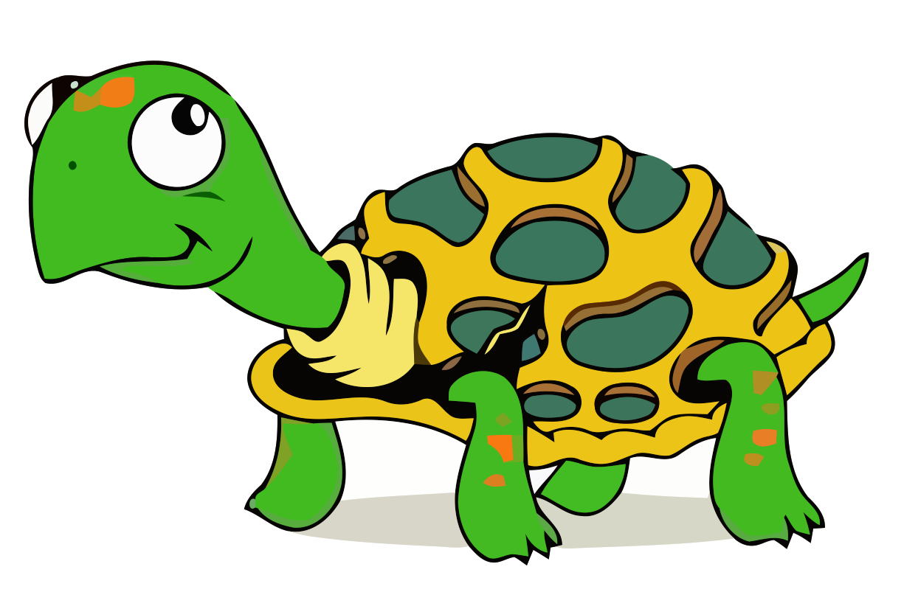
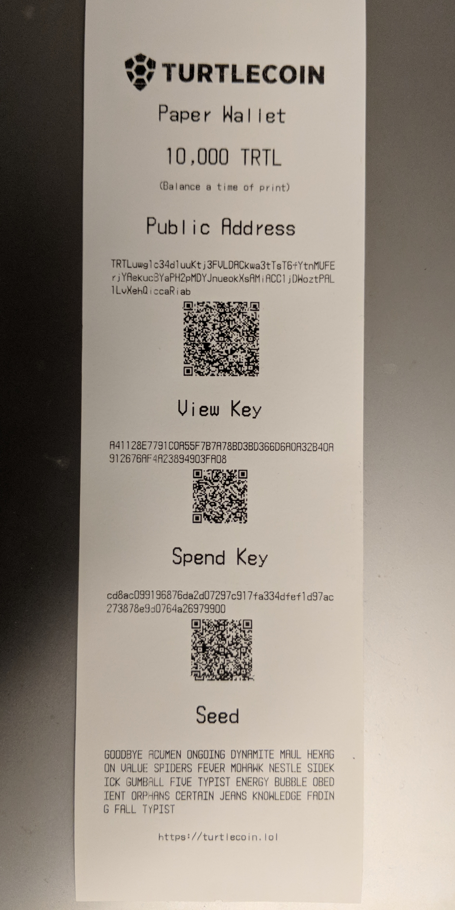

Tom’s Avatar

# **Out of the Shell #4: @月饼tom**

Mar 20, 2018

---

_Welcome to the fourth installment of Out of the Shell, a series of interviews with the developers, designers, and doers behind TurtleCoin. This is @gigantomachia and I’ll be your host._

The TurtleCoin community is full of talented people who contribute their time and skills, but prefer to stay under the radar. I was lucky enough to lure one these humble turtles out of his shell for this interview. Tom (@月饼tom) is a security researcher from Canada who’s been involved in crypto on and off since the very beginning (he mined Bitcoin when it still made sense to do it from your desktop). He originally discovered TurtleCoin on TradeOgre while looking for valuable coins to mine and was immediately drawn in by the community and the TurtleCoin origin story. He now runs one of TurtleCoin’s block explorers and mining pool trackers (<https://blocks.turtle.link/>), as well as one of the community’s public daemons (a public daemon allows a user to interact with the TurtleCoin blockchain without having to run turtlecoind directly on their computer to sync with the blockchain).

I chatted with @月饼tom about how he came to join the TurtleCoin community, what projects he’s currently working on, and why he thinks TurtleCoin has a bright future. Enjoy.

> **Tips welcome:** TRTLuxvBFVNSxovAp3c9C8h8dUttA4sP8hHELDQJXsQZ7JcKfnn3sLkUPGQgQBkvvhXFfAErUqmf52BzyqFaHhEHicRNLnXYfRj _(Gigantomachia)_

**How’d you first learn about TurtleCoin?**  
I could not ignore Bitcoin again after all the attention in November/December of last year and decided to go look for some altcoins to mine. I found Aeon via a forum I was a member of that ran a private pool. After not being so happy with major exchanges for selling the mining proceeds I was looking for new Aeon markets and stumbled across TradeOgre, saw this thing called TurtleCoin and fell went down the rabbit hole.

**So, you entered via mining. Do you mine TurtleCoin exclusively, now?**  
No, not exclusively. I mine some other coins. The nature of the different cryptocurrencies is that depending on the equipment you have it is more profitable to mine some different ones, Zcash/Equihash on Nvidia and cryptonote on CPUs.

**What initially drew you to the coin? What was it that enticed you to jump in?**  
The story of how there was so much BS in the crypto world with white papers, ICOs and whatnot rang true. I had read so many and they all seemed so hollow. They had me at “Hold my beer.” Lets go make a coin without all the pretense and just see where it goes. I am pretty sure all the ICO guys didn’t put down their vodka tonics to go do work, you know?

**So the story behind TurtleCoin drew you in and you started mining TRTL. What led you to get more involved in the community and set up a block explorer?**  
I saw a gap in that basic services like the block explorer were not there yet and knew that cryptonote blockchain software had not been maintained much over the years from working with the Aeon code. I saw it as an opportunity to run a service and enhance my skills in running a reliable service in a coin that I was “invested” in through having spent the time mining it. Basically, it’s a win/win. I get to learn about running blockchain software at scale and help a coin I own a bit of.

**For the non-technical people who might read this and wonder, can you explain the purpose of a block explorer and mining pool tracker? How does that service benefit the community?**  
Ah ya, good question. So the block explorer lets you track all the details of the blockchain, like what the current block is (height), what the reward is for finding or mining a block and, most importantly, to look up transaction IDs and see if they made it onto the blockchain. The pool listing is useful to track the network as most of the mining or block generation is done in pools these days. So, basically, you can watch and see when your transaction hits the chain, and then if someone says they didn’t receive it or it didn’t make a block you have some reference point.

**What’s your professional background?**  
I am a security researcher.

**What’s your favorite pizza?**  
Pepperoni pizza is the best.

**You mentioned earlier not ignoring Bitcoin again after the Nov/Dec run up. Does that imply you’ve been involved in the past? How long have you been interested in crypto?**  
Since the start. But the culture changes and the rapid escalation to more expensive mining technologies (GPU/ASIC) drove me away rather quickly.

**The start start? Were you mining Bitcoin when you could do it from your desktop? What year did you get involved?**  
So early 2010 probably. Yes, I remember being frustrated that I could only mine a few coins and gave up at the time lol.

**So you gave up on all crypto until late last year?**  
I went back and did a review a few times: 2013, 2015.

**Besides the block explorer and mining pool tracker, are you involved in any other projects in the TurtleCoin community?**  
In a small way I feed the results of running a TurtleCoin daemon at scale back into the core project. I am also working on a receipt printer paper wallet project solo.

See Tom print money. Print, Tom. Print.

**What’s the application of a receipt printer paper wallet? I’ve only ever seen them as receipts from bitcoin ATMs. Is that what you’re thinking here?**  
Yeah, ATMs or just an easy way to sell coins to people and give them access via a paper wallet that can be printed quickly.

**That implies face-to-face transactions. That’s an interesting angle I haven’t seen the community talk about yet. Good lead in to a question about where you see TurtleCoin heading.**  
I see TurtleCoin heading into the space of a coin that you can use how you need to use it. If you need to make a fast transaction on the network that will work (it does today), or if you want to go use paper wallets printed on thermal printer paper, that will work too. Hopefully the digit feature will help people understand better the value or amount they are sending at any given time. How much was 0.004005 BTC vs how much is 2500 TRTL.

**What does TurtleCoin have going for it that the other cryptocurrencies with an emphasis on privacy don’t?**  
So another good question. I see other privacy-focused cryptocurrencies having a strong culture around why you should buy or invest in it, and usually a strong “leader” who is directing the investment “advise” and the project. In TurtleCoin I see strong leadership in the technology and culture, but the whole market aspect is not the focus. They kicked all the “when’s the next exchange” and “price!?” folks to a separate discord a few weeks ago so that we could focus on the technology. This means to me that the leadership values privacy and this is not just another pump-and-dump scheme. I guess that does not just apply to privacy coins, but crypto in general.

**Are you saying an emphasis on the tech, not marketing, is a good sign for the coin’s long-term viability?**  
Well marketing is important too, and that happens for sure. I am saying that my interpretation is that marketing is done with concern for the users interests the same as it is with the technology.

**When you’re not working or hanging out in the TurtleCoin discord, what do you like to do for fun?**  
For fun I like to do things like cryptocurrency hacking, time travel and hockey.

**Any particular projects or initiatives you’re working on right now where you’re seeking community input? Any request for the reader or community, or opportunities for people to get involved if they want?**  
So, the block explorer codebase was forked from Karbo and it does not really reflect the branding of TurtleCoin. I would be happy to work with folks on updates that use the material that the folks in the marketing channel have created.

**Anything you’d like to add?**  
I think that TurtleCoin is a good somewhat safeish place for folks to learn about cryptocurrency and blockchain technology if they keep in mind that the markets are super risky. Just use the opportunity to run the wallet/daemon and get some TRTL with mining or the rain and see how it works for them. Other than that just a big thanks to everyone out there in the community. It has been a blast and let’s see where this goes.

> **Tips welcome:** TRTLv2MxqomYoBNjKD1jPeQBRZ6ghG9xpED51C3uSv2VDNgt7u8fHVtA8oEF5sjXC7U1kavfTLAPQKKoPUodidGuDULqYNXihwJ (月饼 tom)

**_Tom, you’ve been a really big help since the beginning, and an expert diagnostician! Thanks for putting up with all the shenanigans :) — Rock_**