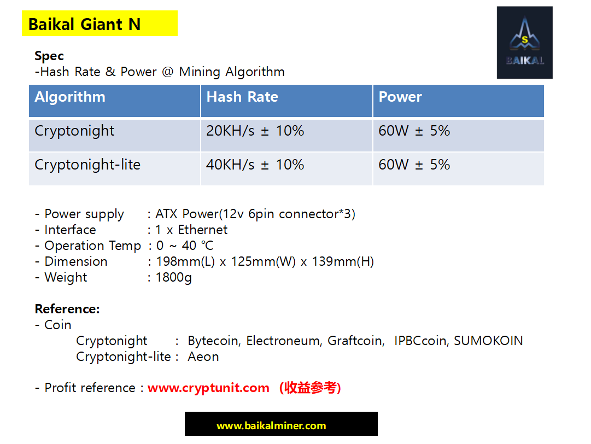

# Take Your Baikal and Shove It Up Your ASIC

Mar 12, 2018

---

ASICs are on the way; what does this mean for the TurtleCoin Network?

## What is mining, and why do I need to prove my work?

TurtleCoin and other Proof-of-Work networks rely on miners to process transactions for the network and keep the blocks flowing. When a miner guesses the right number, a reward and fees are awarded, and the process starts again, but slightly more difficult each time as new miners join. This effort to process the transaction and receive the prize or “proof”, is the “work” involved in the term “Proof-of-Work”.

Menk’s Ryzen 1800X & 1080ti TRTL Miner @ 1,500 H/s

## What’s an ASIC, why is everyone suddenly an expert in algorithms, and best of all, why does this even matter? Slow and Steady, right?

Most of us on the TurtleCoin Network use CPUs and GPUs to mine, which means just about anything can mine a TurtleCoin or connect to a mining pool, whether it be an old laptop, a gaming computer, a fancy mining rig, or even a spare telephone (and our mobile miner, you know, actually mines stuff- who knew!). This also means if you get tired of TurtleCoin, you can go mine BoolBerry or Aeon or something else, without modifications to your hardware. TurtleCoin was made with this type of random CPU and GPU hardware in mind, because we want as many of the little guys as possible around the world, keeping the mining power evenly spread out on as many devices as possible so that there is not one single point of failure.

## How does ASIC compare to CPU and GPU?

ASICs are just chips made to do a single purpose, meaning an ASIC chip is usually engineered for a certain algorithm, like Bitcoin’s SHA256, so if you get a Bitcoin ASIC miner and want to mine DASH later, it’s not going to work, you’re only going to be able to mine Bitcoin and maybe something else with the same SHA256 hashing algorithm.

The benefit is that ASIC miners are more efficient at turning power into hashrate with a smaller footprint, which is why you usually find them packed in to large warehouses near cheap power and cold weather; normal hobbyist miners don’t run these setups. This usually leads to a select few groups producing most of the hash power for the network from a few centralized geographic areas, which has its own risks involved. This is the issue that has everyone’s jimmies rustled in the Cryptonote scene a bit at the moment.

This is the spec sheet for the new Baikal Giant N

One of the top ASIC companies, Baikal, has given the community credible reason to believe that a Cryptonote/Cryptolight ASIC has been created and will be hitting market soon.

Monero first voiced their intent to change algorithms to avoid this issue a few weeks ago, that we know of. As you remember, an ASIC can hash one algorithm only, after the chip has been designed, manufactured, and produced, which makes this a risky production run investment for a company like Baikal.

Coincidentally, on a completely unrelated note, we at Turtle HQ had been eyeballing what an algorithm change might look like, but for a different reason — mainly to get out from under rented hashing networks like NiceHash that were hitting us pretty hard at the time. Ironically, not so much of a problem anymore.

## So what’s TurtleCoin’s official position on ASIC?

Slow and steady. Whatever it takes. Every day.

**We will do everything in our power to deter ASIC compatibility on our network.**

If you’re considering purchasing one of these ASICs for the purposes of mining TurtleCoin, you may wish to strongly reconsider, as we will take any measures necessary to ensure mining stays competitive for all participants, not just those who can afford warehouses overseas.

_Are your jimmies rustled? Would you like to know more? Please watch or participate in our public discussion on the link below about the pending algorithm change regarding ASIC mining on the TurtleCoin network._

[ASIC Resistance, TurtleCoin Hashing Algorithm Change · Issue #74 · turtlecoin/metaCredit to @ZedPea for bringing this to my attention. It has come to our attention that there are credible claims of an…github.com](https://github.com/turtlecoin/meta/issues/74)

**_Cowabunga dudes! I wish all of you crypto network admins out there good luck in dealing with this, and as always, the Turtle dev channels are always open to help others._**

**Please post needs and concerns in our Meta Forum** [**http://meta.turtlecoin.lol**](http://meta.turtlecoin.lol/)

# Have a good week! Keep moving forward!