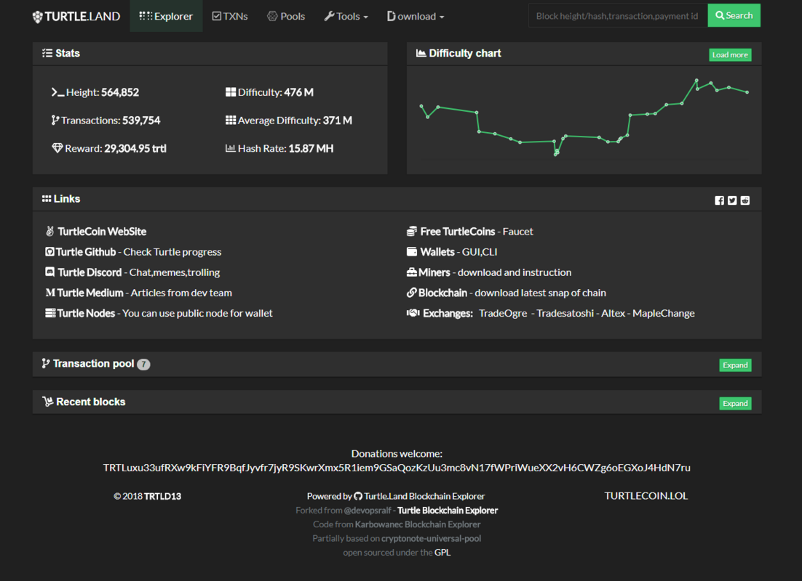
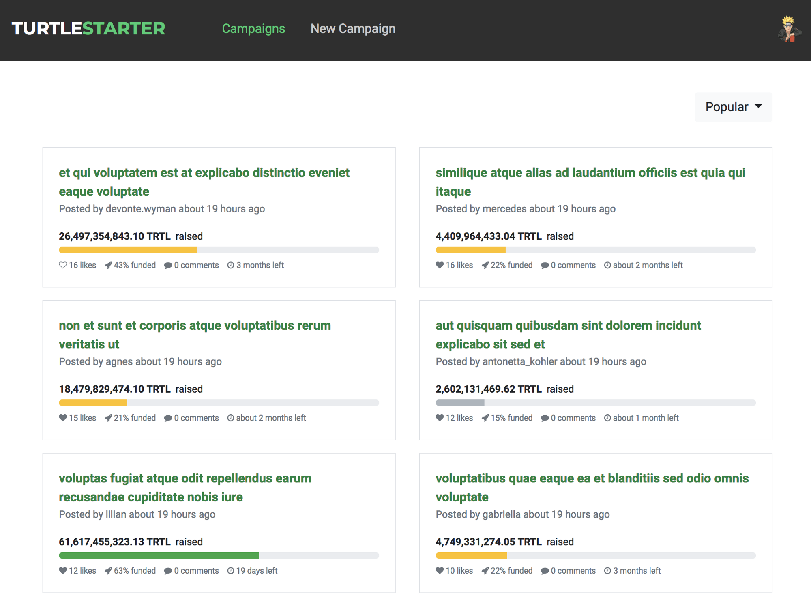
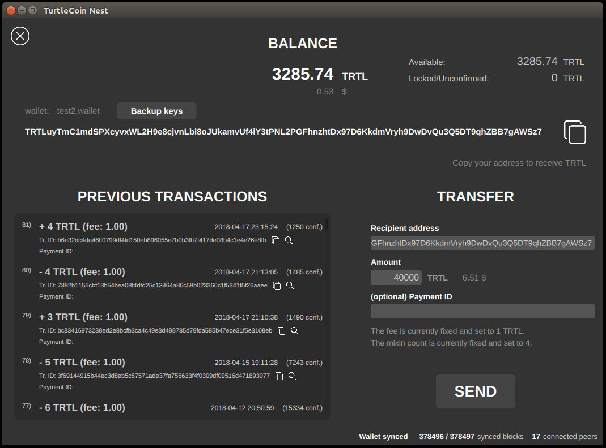

# This Week in TurtleCoin (June 24)

## This week we got a crowdfunding platform, a cooler block explorer, a block bot monitor, and successfully used @here twice without losing a single user!

Jun 25, 2018

---

turtle.land block explorer looks hot hot hot!

**Turtle.land —** “_Hi, Turtle.Land is my project what I building in my free time… Its start as fork of explorer from Turtle-Github…. And from there I add few new things… I wanna make useful “crossroad site” for every relevant info… If you have some idea what I can add… let me know on discord :)_” **— Close0ne —** [**www.turtle.land#7465**](http://www.turtle.land/#7465)

[TurtleCoin \[TRTL\] Block Explorer - Turtle.Land - Pools,Markets,Stats,LinksTurtleCoin \[TRTL\] Block Explorer - Turtle.Land - Pools,Markets,Stats,Links,Wallets,Infoturtle.land](https://turtle.land/)

**TurtleStarter —** _“I started work on it last week and hope to ship a 0.0.1 in 2–3 weeks.”_ **_— AR-X_**

[v1 Checklist · Issue #1 · ar-x/turtlestarterHome page: Show campaigns Home page: Sort listed campaigns by some criteria Login via Discord Campaign detail page…github.com](https://github.com/ar-x/turtlestarter/issues/1)

Nest GUI Has been updated :D

**Nest Wallet —** _“Nest has been updated to 0.23\. Upgrade is mandatory as it includes latest daemon which fixes some blocking bugs. Please note that the local blockchain sync option is temporarily unavailable (due to a bug in walletd). Only connection option is via remote node. Use the CLI (zedwallet) if you need to sync locally. Sorry for the inconvenience. We are working on bringing it back.”_ **_—_ Jon Nest**

[turtlecoin/turtle-wallet-goturtle-wallet-go - A universal gui wallet for TurtleCoingithub.com](https://github.com/turtlecoin/turtle-wallet-go/releases/latest)

**block-bot —** “_This bot, which is still under development, will send a message in a channel giving details of each block, it’s hash, the block’s size, the tx’s in it and it’s size, what tx\_extra is, and it’s size, and what tx\_extra hashes ought to be. If blocks are made in an untimely manner, like 7 second or 120 seconds within each other, it’ll ping RockSteady. This will be especially useful for Karai, TurtleCoin’s in development smart contracts on a side chain(its gonna be awesome)_” **— Sajo**

[Sajo811/turtlecoin-block-botturtlecoin-block-bot - bot to print out stats of every block. in case it gets funky ping rockgithub.com](https://github.com/sajo811/turtlecoin-block-bot)

**TurtleCoin —** _“We’ve made a nice article here explaining to you guys where all the mixins went for those who are wondering :D”_

[Let’s Talk About MixinsWe are moving to static mixins, and we want to talk to you about what those words mean and why that’s important for…medium.com](https://medium.com/@turtlecoin/lets-talk-about-mixins-430730035297)

**Gladiator Bot —**_“ Gladiator Bot is still being received really well with people really enjoying the battles. With the introduction of potions, it added an element more than luck. Potions were introduced at +20hp gain but were buffed earlier in the week to +30hp to make them more worthwhile to use. With some devious Turtles causing their opponents to miss out on wins by simply stopping their attacks and letting the arena time out, an introduction was made this week for the last attacker to be awarded the win. Gladiator Bot was created for use on TRTL coins discord. A community coin with a bot built on community ideas. Ideas to build and improve on Gladiator Bot are welcomed and any ideas that pass the criteria of A) I think I can actually do it… And B)… Nope just A! We had a joint first place in the leaderboard last week but this week we are looking like we have a clear winner already. Good luck to all our turtle Gladiators and have fun!”_**— Caesar Rynem**

[Rynemgar/Gladiator-BotContribute to Gladiator-Bot development by creating an account on GitHub.github.com](https://github.com/rynemgar/gladiator-bot)

# Shoutouts from the community!

**Anybody can submit a shoutout, just look for the link next weekend in the chat!**

**Sajo8#2953 —** _BIG thanks to rashedyt for not sleeping and implementing the getblock() and gettransaction() calls in the python rpc Also big thanks to zpalm for doing that as well You guys rock!_

**Rogerrobers —** _Shouts out to browns1964champs for putting a TurtleCoin sticker on the stall in his local dive bar’s bathroom_

**Mineirofox —** _The Caesar Rynen is doing a great job with the coliseum game. Keep it up as we are all enjoying your hard work._

**Anonymous—** _Thanks to the sidewalk, for keeping me off the streets._

**Rashedmyt —**_A huge shoutout for the awesome developers for being as transparent as possible unlike other cryptocurrencies._

**ar-x —** _Shoutout to @rashedyt and @Sajo for working through the API docs_

**zpalm —** _Hi canti\~\~_

**(no name) — _Thanks_** _to Canti for rain, Zpalm for zedwallet, bebbop von saberhagen for the links, and the community for teaching us to code._

**pHaTe🐐** — _Recording first podcast Wednesday morning to be released Thursday_ [_https://altcoinbuzz.io_](https://altcoinbuzz.io/) _<< check out the podcast there, or YouTube iTunes Spotify._

**vanlemagne —** _Tips re investment in Blockchain, Do you sell a TurtleCoin or keep it for later?_

**armitage —**_Shoutout to every security guard shredding skateparks_