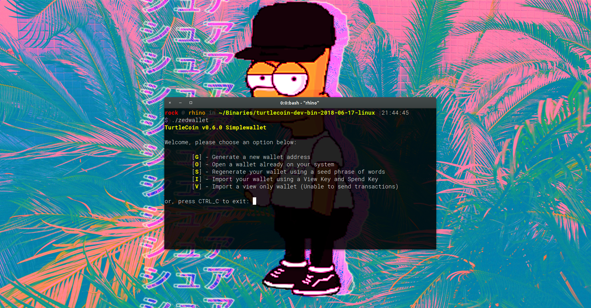
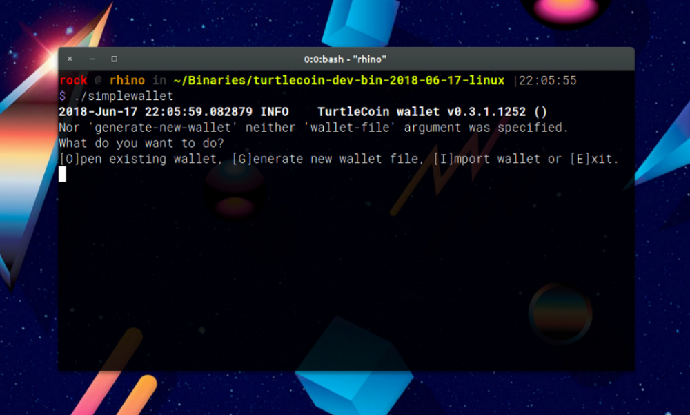
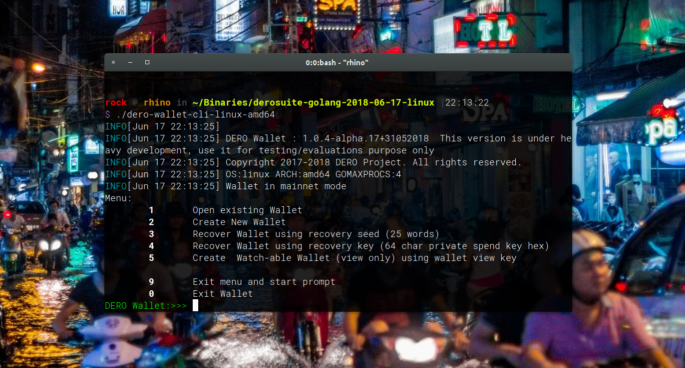

# Zedwallet, A New Simplewallet for CryptoNote Currencies

## Some of you may have noticed in the last few releases that Simplewallet has been looking a bit more polished. In fact, what you may not have noticed is the old Simplewallet is gone, and we’ve all been using the new Zedwallet since v0.4.2.

Jun 18, 2018

---

**For more info ->** [**Join the TRTL Network Community Discord Chat**](http://chat.turtlecoin.lol/)

With that being said, now that there’s been enough confusion with the name not being changed, we decided it was time to let the community decide on a new name and to make an official announcement about the change. The community spoke, and decided on “Zedwallet”.

[Help us rename Simplewallet · Issue #111 · turtlecoin/meta@ZedPea wrote the current Simplewallet from scratch, and as such, deserves some type of distinction to differentiate it…github.com](https://github.com/turtlecoin/meta/issues/111)

To make the introduction to the new Zedwallet, who better to talk about it than the guy who wrote it, Zpalmtree!

**Welcome Zpalmtree :) Thanks for making this wallet for the TurtleCoin Community. Tell us a bit about before the rewrite, do you remember what the original** Simplewallet **was like?**

Zpalm, IRL (actual size)

Henlo frends. First of all, thanks for all the kind words from people who have enjoyed the wallet, it feels great making software people use and enjoy.

Old Simplewallet is OK. I’ve always been a fan of command line wallets, and this did the trick, but it could have done with a few UI tweaks. For example, I found the transfer syntax `transfer mixin address amount -p paymentid` a bit of a pain, when you haven’t used your wallet in a while it’s a bit tricky to remember the order of the arguments. Furthermore, the code was also pretty hard to modify, making it pretty slow to add new features.

**I understand that the new Zedwallet has quite a few features added to it that the original didn’t have, and it even has the new container format, can you tell us a bit about the new things a user might notice?**

The main aim of Zedwallet was to make the wallet more user friendly. For example, sometimes you would send a transaction, and it would be accepted by your daemon, but hang out in the transaction pool for an age because it was too large to fit into a block, or it would give you a not very helpful error message like “Transaction too big” (How much is too big?!). Now, it will never send a transaction that is too large for a block, and will automatically perform fusion transactions to shrink the size of your transactions. If that doesn’t do the trick, and the transaction will still be too big, it will offer to split your one transaction into multiple transactions.

New Zedwallet)

One thing I think is very cool but I don’t think is used that much is view wallets. These are a way to let you see incoming transactions to your wallet, but you don’t have to store your private spend key to do so. What this means is that lets say you’re mining to your wallet, you can see how much you have accumulated, but if your PC gets stolen, or you get hacked, an attacker can’t steal your funds, they can just see how much sweet, sweet TurtleCoin you have :)

**Tell us about the container format, does that allow someone to run more than one wallet address? What’s with the name?**

The container format lets people have so called “[subaddresses](https://monero.stackexchange.com/questions/3673/what-is-a-sub-address)” inside one wallet file. This [API isn’t exposed in Simplewallet](https://github.com/turtlecoin/turtlecoin-docs/wiki/Resources), because it’s more aimed at a simple “one user one wallet” kind of thing, but this is very handy for service providers, such as [Canti’s](https://discord.gg/5KSZXnh) and [Fexra’s](https://discord.gg/JTzD9z) upcoming web wallets. Because of the way the privacy code works, it takes a bit of a long time to scan wallets compared to something like Bitcoin, and these subaddresses allow a service provider to scan multiple wallets with pretty much the same speed as scanning one wallet.

**What made you finally rewrite the wallet, was there a single piece that you didnt like much that made you say “right, time to scrap this and start over”?**

Before Simplewallet was rewritten, it had a different file format to Walletd, which was a common cause of difficulty for new users. They’d make a wallet in a GUI, then go to open it in Simplewallet and it wouldn’t support that format. I think Rock said something like “Why not just use the same file format?”. I thought this would be a pretty quick fix, but the old Simplewallet code was pretty heavily coupled to the file format and API, and so swapping it out would have been a large ordeal. It seemed like a better idea to start from scratch, with some much easier to read and modify fresh code.

The old Simplewallet we had originally

**I understand you’re currently looking for contributors to Simplewallet, as it’s somewhat of a gift to the community for everyone to work on. What would you like to see a new user start out with? Is there anything in mind that may be low hanging fruit out there for an aspiring contributor? What is something that you want developed that might be bigger than your capabilities that you need help with?**

I’d like to see Simplewallet have a few more of the features that a standard CLI program might support, to be familiar and usable to shell users. Things I’m envisaging is support for shortcuts and[ symbolic links](https://en.wikipedia.org/wiki/Symbolic_link) when you open wallets (e.g., Wallet file name: `~/.mywallet instead of /home/me/.mywallet`), and [readline](https://en.wikipedia.org/wiki/GNU_Readline) support (This is a commonly used GNU input library), so users can retrieve the previous command by hitting the up arrow, and move around their input, rather than have to trash the whole line if they make a mistype.

**Tell us more about symbolic links, that might be a new one for a lot of our users.**

A few users might have encountered these when they wanted to change the location of their TurtleCoin blockchain with a GUI wallet to another drive — it’s basically a special file which points to another file or folder — So perhaps your GUI goes to open up the blockchain in `C:\username\appdata\TurtleCoin` — and you pop a symbolic link there which means when something goes to open that file, it actually opens up `D:\TurtleCoin.` It’s just a nice feature that lets you can configure your PC exactly how you like.

Back to possible improvements — I also liked the look of Dero’s menu system in their CLI wallet, which could be handy to use. Something like `[0] — transfer`, `[1] — balance`, so users can either type the full command name or just hit the relevant number. Spelling is hard, OK!

Dero’s CLI Wallet

As Rock says, whilst the wallet is now called “Zedwallet”, I don’t want anyone to think it’s “my” wallet, and no-one else can contribute to it. I see it as the TurtleCoin wallet, and if you want to make a cool feature, or a bug fix, please do!

[Contribute-to-Zedwalletturtlecoin - TurtleCoin is a private, fast, and easy way to send money to friends and businesses!github.com](https://github.com/turtlecoin/turtlecoin/tree/development/src/SimpleWallet)

[The beginner's guide to contributing to a GitHub projectThis is a guide to contributing to an open source project that uses GitHub. It's mostly based on how I've seen Zend…akrabat.com](https://akrabat.com/the-beginners-guide-to-contributing-to-a-github-project/)

The only thing I’d like to make sure remains is the ease of use. If you’ve ever used other more matured CLI wallets, they’ve got a TON of features, which means there are 60 or so commands, so finding the right one is a bit more effort.

I’m thinking perhaps if a lot more commands end up getting added, they could be hidden behind an “advanced” help message, which lists the rarer used commands. Then, your new user can easily find how to send funds, check their balance, and so on, without having to wonder what the heck a `[tx\_extra](https://monero.stackexchange.com/questions/tagged/tx-extra)` is.

**What would you add and what would you hide? What does the average user need just to get by, do you think?**

There aren’t a ton of things a standard wallet needs. I’m thinking maybe “`help`”, “`balance`”, “`transfer`”, “`export_keys`”, and “`exit`”/”`save`”. I might actually add this advanced menu feature soon, I’m liking the sound of this simpler help message ;)

In regards for things to add, there’s a lot of extra commands we could add. For example, developers might be interested in getting their public keys as well as their private keys. Perhaps you might like to print the data of a block, or see how an individual transaction breaks down into separate key images. Maybe you would like to hex decode the stuff in a tx\_extra and print it to a file. (Shelltube soon??) There’s a ton of cool stuff we could add which isn’t really important for regular users at all, but is just pretty interesting.

**What’s in the future for Zedwallet now that it’s got a shiny new coat of paint and a new name?**

Not sure what’s in the future for Zedwallet. For now, I just want to make it the best at handling every damn error that occurs. GUI wallets are great for the newbies, but because Zedwallet is hooking directly into the TurtleCoin core code, it can do a lot more to handle all the weird edge cases. If you find anything that makes it crash, or it can’t handle, please let me know! I’d love to fix it.

> I can’t wait to write a new-new version of Simplewallet when the daemon gets rewritten ;)

**Is there potential for the new Zedwallet to be in its own repo so it can be included in TurtleCoin, and other networks like Monero, Masari and Aeon as a submodule maybe?**

It would be great for other CryptoNote networks to get to use Zedwallet. I think it’s a pretty nice [QoL](https://en.wikipedia.org/wiki/Quality_of_life) upgrade for other networks, unfortunately there are a few changes needed in the Walletd code and other sections of the codebase needed, so it’s not a 100% drop in replacement. Separation of concerns is also always nice — It’s nice to have small sections of code (for example, a wallet, a daemon, and so on) which can stand on their own and be easily replaced or rewritten when needed, so we don’t have this massive chunk of monolith code which is a bit scary to change.

**Anything you’d like to add?**

> Thanks to everyone who has used and contributed to Zedwallet!
> 
> To contribute to Zedwallet development, check out the code, and then learn how you can contribute to it with the handy guide on how to contribute! — RockSteady

[Contribute-to-Zedwalletturtlecoin — TurtleCoin is a private, fast, and easy way to send money to friends and businesses!github.com](https://github.com/turtlecoin/turtlecoin/tree/development/src/SimpleWallet)

[The beginner’s guide to contributing to a GitHub projectThis is a guide to contributing to an open source project that uses GitHub. It’s mostly based on how I’ve seen Zend…akrabat.com](https://akrabat.com/the-beginners-guide-to-contributing-to-a-github-project/)