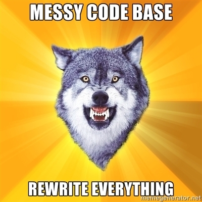
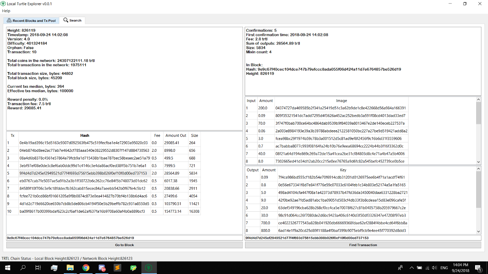

# This Week In TurtleCoin (Oct 8, 2018)

Oct 8, 2018

---

# Developer Community Updates

**This week we had the extreme pleasure of being interviewed on Bitcoin Uncensored! Check out the interview! You’ll love it!**

**New Whitepaper! Proof of Synchronicity! Calling for participants!**

[Proof of Synchronicity TRTL001 paper debate · Issue #1 · turtlecoin/turtle-labs@rocksteady (TRTL)#7588 and others, where is the best place to discuss the Proof of Synchronicity paper? I'd like to…github.com](https://github.com/turtlecoin/turtle-labs/issues/1)

**T.Scripta —** Currently Reworking the UI and adding some new things! Check the current progress I’ve made. **— Val**

[turtlecoin/turtle-wallet-tscriptaTurtlecoin Wallet made in C# WPF. Contribute to turtlecoin/turtle-wallet-tscripta development by creating an account on…github.com](https://github.com/turtlecoin/turtle-wallet-tscripta)

**WalletGreen / turtle-service rewrite —** I’ve been spending the last few weeks rewriting the backend for turtle-service and zedwallet, called WalletGreen, from scratch.  
The main motivation behind this is making the code much more readable, and extensible. This will allow us to more easily add new features, and possibly provide a richer API, so it’s easier to build a wallet, or other services which need to interact with transactions, such as payment gateways.  
It’s also going to use a more portable file format, so it’s easier to open a wallet file in multiple different programming languages.  
So far, I think I’ve got syncing transactions (both incoming and outgoing) working correctly. I’m now looking at implementing sending transactions. Once that’s done, there’s not actually that much left to do, aside from implementing a few methods to display the info we generate, such as the transactions we own.  
As part of making the code easier to read, the past few days I’ve been migrating the codebase from C++11, to C++17\. These are different standards of the C++ programming language, and support for a newer standard allows us to use all the cool new features available to make our code easier to read and write.  
For any nerds out there, it’s also added support for GCC on OSX, and we now support a much wider array of compilers with our automated build suite. Hopefully this will make it easier to build TurtleCoin on less well known platforms that we don’t provide builds for.  
Note that if you currently like to compile from source, you may need a newer version of your compiler to compile with these updates. The instructions on Github will be updated when this patch gets merged into development. **\-zpalm**

[turtlecoin/turtlecoinTurtleCoin is a private, fast, and easy way to send money to friends and businesses! - turtlecoin/turtlecoingithub.com](https://github.com/turtlecoin/turtlecoin/compare/walletgreen-rewrite)

**Local Turtle Explorer** — After the previous post, I have redesign the layout of this project. At this point, you can run the local turtle explorer on your windows PC by just double clicking it. The daemon is running in the mode that other users can connect; in the future I am planning to add an option to choose to start the daemon in different mode. I would like to encourage everyone to run the local explorer on your machine as it helps the turtle network grow. I am also planning to combine the trtl wallet with this project. If anyone is interested in collaborating on this project, feel free to contact me on discord. **— Sabo (Revolutionary)**

[turtlecoin/local-turtle-explorerContribute to turtlecoin/local-turtle-explorer development by creating an account on GitHub.github.com](https://github.com/turtlecoin/local-turtle-explorer.git)

**Turtle Simulator —** Turtle Simulator is now out in alpha! (sorry mac users windows only at the moment!) Thank you to all the testers so far for your help. All ideas on how to make it a fun game are welcome, so come on down to the dev gaming channel and give me a shout! Thx to the community for this great opportunity! **— Oiboo**

**Turtletor —** This week I finally got around to updating the tor version of turtleturtle.org. I found a nifty docker image that I tweaked to host dark web sites from a docker container. Anyone who is interested can check out my github **— crappyrules**

[crappyrules/turtletorEasily setup a hidden service inside the Tor network - crappyrules/turtletorgithub.com](https://github.com/crappyrules/turtletor)

<http://trtljx3ovmd7kjlc.onion/>

**TurtlePi —** TurtlePi took a few steps forward the past few weeks. There is now a simple setup script included in the scripts folder of the TurtlePi repo on github that you can launch from your raspberry pi and it will automatically configure your pi with the latest TurtleCoin release and turtlecoind-ha. More work is in progress and I am hoping to have a base image ready for release here soon. **— crappyrules**

[turtlecoin/turtlepiContribute to turtlecoin/turtlepi development by creating an account on GitHub.github.com](https://github.com/turtlecoin/turtlepi)

**TurtleEDU** — We’re setting up TurtleEDU to help the community become more knowledgeable as users, and help people who want to know about dev stuff have an easy route to being a TRTL dev. Right now, in the chat if you type `*student` you get the student role and access to #edu-general and #edu-help channels. We're teaching classes of real-world portable skills, but using TurtleCoin as the core example in each lesson, so the first thing you learn how to do when you become a developer is how to interact with our blockchain. Those users and devs who learned it here first will be our biggest recruiters and the biggest legitimizers of the project as they add their TRTL stuff to their resumes. The more we ingratiate ourselves to the young professionals who have ample time and thirst to learn, we will have no shortage of junior devs who are chomping at the bit to get the experience. Structuring this process as an at-your-own-pace online class seemed like a good way to achieve this.

**Paper-Turtle** — Paper Turtle is a printable paper wallet. It features a new frontend, and a better printing layout! This merges the two previous paper wallet ideas that were in place before. Thank you TurtleCoin community! **— ChrisCrypto**

[turtlecoin/paper-turtleTurtle Wallet Generator. Contribute to turtlecoin/paper-turtle development by creating an account on GitHub.github.com](https://github.com/turtlecoin/paper-turtle)

**Project Krang —** This week was a mixed bag of things — Created a alpine docker container with just glibc, dumbinit and turtlecoind (brings the size down from 600MB to \~ 60MB. To increase performance, security and reduce noise. The dumbinit provides a better fail scenario that prevents zombie containers that don’t die, due to standard init resilience to death which is a problem for a container. — Got good with git, Cleaned up the repo, Started some new branches to do my work in, Did a squashed commit to combine all my commits into one before i do a Pull Request, and learning how to be a good git-izen. Thanks SoreGums for the pointers. — Tested Sajo’s TRTL-pycli out and submited an issue and a simple PR to correct a tiny issue. Thanks Sajo — Did a manual test run of the automation suite start up / teardown (phase 1 just a node on DO), which worked fine, THE NEXT STEPS are to complete krang.py with an TUI type interface and setup a docker container that it can live in and anyone with docker can launch quickly and easily with all pre-requisites in place. Slow and Steady but i am making progress now.

**NOTE** Looking forward to the Bitcoin Uncensored interview that is happening on the 3rd This week. I love the BU show and think that Chris DeRose would love to hear how us TRTL’s get down and dirty. I also setup a new Turtle Tank with an Eastern Short Neck Turtle… The sucker will outlive me most likely. See you all next week. **— Slash-atello**

[4Reallive/krangThe TurtleCoin Blockchain Automation Suite. Contribute to 4Reallive/krang development by creating an account on GitHub.github.com](https://github.com/4Reallive/krang/tree/Development)

**Check out Slash-atello on Bitcoin Uncensored talking about TurtleCoin Community and his story about joining the worlds most friendly street gang!**

**TurtleCoin Explorer** — My re-imagining/expansion of the traditional block explorer has been up and running for about two weeks. Check it out at [http://trtl.rocks.](http://trtl.rocks./) It uses a lot of newer technologies compared to the original block explorer, including Docker and Docker Compose, FeathersJS, GO, TimescaleDB/Postgres, Nuxt.js, Socket.IO, etc.

**Sections that are mostly complete:**

* **Stats Bar** — The stats bar, located on the left side of the screen, gives you an up-to-date look at the network; data is updated every 30 seconds.
* **Nodes** — The “Nodes” page allows you to see historical and live information for public nodes. The table provides current information and is updated every 30 seconds. The graph not only gives you the ability to look at historical information for as many nodes as you like (click on the checkbox next to the node name to add/remove them from the chart), but also allows you to compare different attributes (e.g. hashrate vs. difficulty) over a specified time period.
* **Pools** — The “Pools” page does everything the “Nodes” page does but with pool data. In addition to the historical line graph and regularly updated table data, there are two pie charts which display current pool hashrates and miners. An additional feature is the ability to generate a mining config or command for a given pool. Clicking on the arrow, next to the pool you are interested in mining in, will open up a list of available ports for that particular pool. Chose a port which works for your mining rig and click the “Generate” button. In the config wizard, you first select the mining software you use and your OS, then enter the wallet address you want to mine to, and then verify the settings. Finally you are given a pool config and/or software command for that pool. You can copy the config or command to your clipboard, for easy copy/paste, by clicking on the “Copy” Button. While the functionality is complete, I need to add more mining software and their respective commands/configs. If you have the config/commands for software that isn’t on the list, or you have any config/commands additions/changes to add to the existing software please reach out!
* **My Pool Stats** — The “My Pool Stats” page allows you to check your mining stats at all the pools we have in the database. Stats include your hashrates, recent payments, total amount paid, total hashes, and any remaining balance you have. You can either check once, by clicking the “Poll Once” button, or get updates every minute by clicking the “Poll Every Minute” button. By selecting the arrow, next to a pool name, you can see the most recent transaction data which includes the time of the transacton, the hash, and the amount. Additionally, you can also export the information for each pool. Simply select as many or all pools by clicking on the checkbox next to a pool name and press the download button. The payments data format still needs work, but all the information will be there.

Also, your wallet address is saved in a cookie whenever you enter it in either the pool config wizard or on the “My Pool Stats” page, making it easier to use the functionality on another page.

If you’re interested in helping out or learning more about the project check out the repo **— Discord: andrew | trtl.rocks or Github: andrewnk**

[turtlecoin/turtle-explorer-vueContribute to turtlecoin/turtle-explorer-vue development by creating an account on GitHub.github.com](https://github.com/turtlecoin/turtle-explorer-vue)

[TurtleCoin ExplorerTurtle Explorertrtl.rocks](http://trtl.rocks/)

**turtlecoin-rpc-go —** For those who don’t know about this project, It is an RPC wrapper written in Golang while I was learning about it.. At that time I just wanted it to work.. after working on python and js wrappers for a while I have thought that my wrapper can be improved in a lot of ways and could also have a standard initialisation as other wrappers. So here I am with updated code and slight error handling which will be improved in future for sure. I also will update the documentation to give examples for starters. **— rashedmyt**

[turtlecoin/turtlecoin-rpc-goA Golang wrapper for the TurtleCoin RPC API. Contribute to turtlecoin/turtlecoin-rpc-go development by creating an…github.com](https://github.com/turtlecoin/turtlecoin-rpc-go)

**Turtacus** — a way for players to battle each other to the death! Players fight until only one remains standing and the winner is issued an amount of TurtleCoin in reward for their win! With every win, comes an entry onto the leaderboard and on Sundays, the top three on the leaderboard are paid 10,000 TurtleCoin, 6,500 TurtleCoin and 3,500 TurtleCoin respectively. To increase your odds of winning, you can buy potions and stat points. These have now been reduced in cost.

Potions are down from 150 TurtleCoin each to 25 TurtleCoin each.

Stat Points are down from 300 TurtleCoin each to 100 TurtleCoin each.

The single battle prize is directly linked to Turtacus’s balance. The more contributions he receives, the higher his prizes will become! **— Rynem**

[Rynemgar/Gladiator-BotContribute to Rynemgar/Gladiator-Bot development by creating an account on GitHub.www.github.com](https://www.github.com/rynemgar/gladiator-bot)

**TRTL-CLI-py** — I fixed some error handling and added a new “nodes” feature! Use nodes or no and a table of all the nodes and URLs will appear. Check it out! **— Sajo8#2953**

[turtlecoin/TRTL-CLI-pyrewrite of @mrrovot's TRTL-CLI-py. Contribute to turtlecoin/TRTL-CLI-py development by creating an account on GitHub.github.com](https://github.com/turtlecoin/TRTL-CLI-py)

# Community Advertisements

**TRTLCO.IN** public node! Thanks to all the wonderful people in the community, i wanted a way to give back. That is exactly what the TRTLCO.IN public node is! Its a fast, reliable, and cheap public node to use. The fee will be 0.5 TRTL per transaction! WOWZA! Thats lower than the network fee! Start today by using the trtlco.in remote daemon. **\-ChrisCrypto**

[**val.turtlenode.online**](http://val.turtlenode.online/) \~ 25 TRTL Fee Daemon

Our predictable solo mining pool for TurtleCoin is off to the races, now minting \~20 blocks per day. And still no fees: ALL rewards go to miners! Join us: <https://cryptonote.social/trtl>

Be a true Turtle Hero! Sync your wallet with [**turtlenode.online**](http://turtlenode.online/) — one of the finest public nodes available — make it your public node of choice today! A great node with a rubbish website! Visit **turtlenode.online** now! :-D

**Turtle At Pool Party** just got update to BETA 0.7! — Public Nodes (for remote wallets) and Block explorer got added on our site, check it out here today <https://turtle.atpool.party/nodes>

“Using **turtlenode.online** for my wallet synchronization and transactions has improved my life immeasurably” **— Chrisdebo.**

1/2 turtle fee node at <http://turtlenode.co/>

# Community Bounties

**Brand new TurtleCoin bounty presented by rogerrobers and slash-atello! Meme Bounty: New Concept — Meme Warfare Simulation**  
**Simulation :** TRTL is under attack and needs the TRTL army to represent.  
Produce TRTL memes that establish TRTL as a force to be reckoned with and also demonstrate our defensive capabilities.  
_Post your best memes to the trtl subreddit and the one that garners the most upvotes by the end of the contest wins 750k TurtleCoin! Good luck :)_

# Community Shoutouts

Judderz — You want Turtle decals, come see me :)

Oseru/Hasagi — Amazing work by turtlenode.online for hosting a low tx fee node! Glad to use your node my man!

Oseru-Hasagi — Also a shoutout to Turtle?#3684 for his birthday! Expect a few shells sent your way on Monday. ;)

Moneymind420 — Give big shout out to Rocky steady !!! We love Turtles !!!

anon — zpalm’s voice gives me the tingles

Khem Boi — Shout out to all the forking projects including monkey tips, and shout out to all the new miners out there helping the network!

Freeman — riche en information, merci

Captain Jac0 — Arrrrrr to all Turtles!

RockSteady — Shoutout to Nuclearprime

greywolf³ — much thanks to Zpalmtree for the blog’s feature story on transaction inputs and fusion transactions

anon — i have a really big crush on zpalm

Val#1969 — Just made a cheap daemon! Heres the daemon Address: val.turtlenode.online:11898 It might not be the most stable thing out there but it works!

iburnmycd — Shoutout to Zpalmtree for working diligently to re-write WalletGreen. I’m looking forward to see what he comes up with.

iburnmycd — Shoutout to CrappyRules…. for starting work on the new TurtlePi project! Can’t wait to see what you put together.

Rogerrobers — Shout out to the shout outs! Love seeing our community involvement :)

greywolf³ — great idea from brianwentzloff about possible TurtleCon

Blackbeard — Arrrrr

greywolf³˜ — thanks Rocksteady for “Running A Public Node For Fun & Profit”; and thanks japakar and Zpalmtree for help in setting up and launching my public node

greywolf³˜ — thanks to morpheus and Crappyrules for hand-holding me through a linux driver install in my windoze-to-linux rig makeover

dsanon — shoutout to JerMe404 for his generous tipping! :D

Gerry Mosha#7276 — A new cryptocurrency named Celestial will be released in the next week. Make sure to check out one of the first coins to be mineable only using a CPU. Check out our website to learn more: <https://celestial.cash/>.

And with that, this concludes our roundup. I didn’t want to end it without something to smile about, so here’s what I like to call “The Trials and Tribulations of TurtleMarine”

_Originally published at_ [_TurtleCoin_](http://blog.turtlecoin.lol/archives/this-week-in-turtlecoin-oct-8-2018/)_._