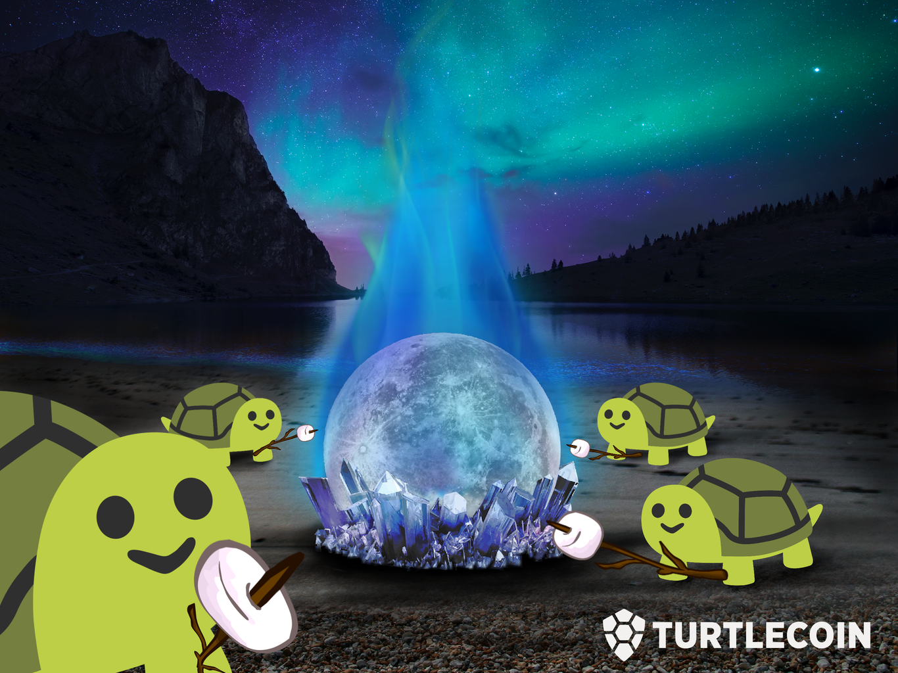
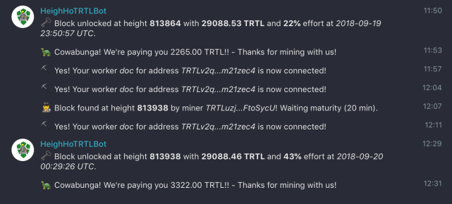

# FunkyPenguin’s Turtle Pool Secrets

Jan 11, 2019

---

A lot of you out there have questions about how pools work and what goes into running a successful one. Today we’re checking out an interview with FunkyPenguin who runs probably one of the coolest setups I’ve seen so far with all of the pools I’ve seen. Maybe I’m just a nerd, but I have a big appreciation for the way he’s doing things.

You’re gonna love this one!

art by Teacup

## RockSteady

Thanks again for agreeing to the interview. The purpose of this interview is for us to highlight smaller pools that have unique things about them. Giving exposure to smaller pools is important in diversifying the hashrate. I hope today to hear about you, your pool, your history in mining and what a user might find unique about your pool.

## funkypenguin

Cool

## RockSteady

Your pool is a cool one, and I think the miners as well as developers will appreciate the unique qualities to it. You first came on my radar with some of the interesting infrastructure work you were doing behind the scenes. I’d like to get in to that soon, but first, tell us how you got involved in TurtleCoin, and what led to you running a pool.

## funkypenguin

(I’ve documented this here: <https://www.funkypenguin.co.nz/opinion/what-is-turtlecoin-and-why-do-i-care/>), but here’s the off-the-cuff version

I was opportunistically looking for coins to mine after the Monero Cryptonight v7 fork, so I spent some time on cryptunit.com. Every so often, I’d see “TurtleCoin”, and laugh at what a silly name it was, and how ridiculous the crypto space had become.

Somewhere (maybe Reddit) I saw the headline for the BlockZero (Kevin Rose) podcast featuring TurtleCoin, and the name triggered some brand recognition. The level of respect that Kevin had for the project, and the way “community” was highlighted, changed my initial skeptical opinion, and I jumped into the Discord

I felt that I wanted to be more than another opportunistic miner, and that a “baby” cryptocurrency was a good place to start learning.

(There was no NZ mining pool)

I’d already spent 6–8 months building my Geek’s Cookbook (a collection of self-hosted apps running within Docker Swarm), and wondered whether I could build a TurtleCoin mining pool. I figured I should start with a testnet, so I started asking some questions in #dev\_general, and @SoreGums pointed me in the right direction. I ended up submitting a PR for a testnet Docker instance of the TurtleCoin daemon which could be used to create a testnet in total isolation from mainnet (<https://github.com/turtlecoin/turtlecoin/blob/development/Dockerfile.test>

Having built a testnet, I started working on the mining pool, learning about wallet/daemon/redis/pool, and how they interrelate. I wrote up the Docker Swarm design (a bit outdated now) at <https://geek-cookbook.funkypenguin.co.nz/recipies/turtle-pool/>

[Turtle Pool — Funky Penguin’s Geek Cookbook](https://geek-cookbook.funkypenguin.co.nz/recipies/turtle-pool)

There were some interesting challenges re how the pool components talked to each other, some of which lined up very well with the “one-process-per-container” model of Docker

I sort of fell into it from there, started mining in my pool, discovered that I could _advertise_ in #mining , posted my pool to r/TRTL a few times, and enjoyed the process of mining “together” with other geeky crypto enthusiasts

## RockSteady

It’s great that you’ve documented your journey the whole way, and as a microservice nerd in my own life, I feel a personal respect for what you’ve done.

## funkypenguin

(To be honest, I also want to profit from crypto, and I figured I’d leverage my systems experience to build pools to amass some coins, rather than strictly mining-and-selling-and-hodling)

## RockSteady

You’ve got a cool frontend on your pool, and as I remember, you were one of the first to have the new-style interface. What are some of the unique qualities of your pool that would be interesting to a miner looking to diversify their hashrate some?

## funkypenguin

I polled my miners on this question, asking “what features does a miner really care about?”. The best response was from @slashatello, who said “miners care about.. BLOCKS”. I was interested in the telegram/email notifications from <https://github.com/dvandal/cryptonote-nodejs-pool>, which remain my favourite feature. Here’s an example:

## RockSteady

That looks cool, break it down for me- what’s going on in that pic?

## funkypenguin

**11:57 :** _The pool restarted (I’m running turtlecoind-ha, that’s another story), my rig connected_

**12:04 :** _The same again (this happens when the daemon gets stuck, it sometimes takes a few goes to restore stability)_

**12:07 :** _One of the miners finds a block. Yay! Now we wait 20 min to confirm it’s not an orphan_

**12:11 :** _Yes, daemon restarts again_

**12:29 :** _Block is not orphaned, now is the first time (based on these notifications) we see what our effort was (43%). Unlike the original turtle-pool software, lower % is better, so we “found” this block in 43% of the time we’d statistically expect to (we were lucky)_

_<by this time, the wallet has received the block reward. Redis calculates how much each miner is due, and payments are prepared>_

**12:31 :** _The pool sends the miners their portions of the block reward (minus my 0.0987654321% fee), everyone is happy_

> _(the fee is a funny story actually — when I first setup the pool, I looked at the list of pools and saw someone else’s pool listed as 0.0987..%. I thought it was a clever attention-grabbing move, so I adopted it for myself. I think I read later that it was just a math bug!)_

## RockSteady

That’s pretty funny, actually! Thanks for giving us the play by play. That’s a pretty intricate setup. So you’ve made a pool, and you’ve written guides and Dockerfiles for us, what _don’t_ you do?! You’re awesome! What do you have planned for the future, and what are you interested in learning right now?

## funkypenguin

Thank you

Well, this daemon restarting thing is a bit of a PITA, and the original platform I ran my swarm on was heavily contended at times, so I’ve just finished migrating the pool to a Google Kubernetes Engine (GKE) cluster. I still have the occasional daemon issue (as evidenced above), but we seem to recover from a stalled daemon with a few quick restarts.

I overspecced the GKE cluster when I built it (I’m only using 22% of my resources for Turtle/Moneytips pools), so I’m currently playing with autoscaling the cluster, as well as using a “tainted” nodepool running (cheap) pre-emptive node instances for doing CPU-heaving stuff like syncing new coins blockchains. The fact that they’re pre-emptive means that Google could turn them off at any time, but the GKE engine would just spin me up a new one in a few min, and for the purposes of an initial blockchain sync, I don’t need to maintain any sort of availability

So I’m enjoying learning more about the world of Kubernetes / Terraform. I’m also continuing to build the Geek’s Cookbook community (<http://chat.funkypenguin.co.nz/>), the discord gets quite busy at times, and there’s now enough geeks on board that I don’t end up answer every question myself, which is great to see.

I’ve dabbled with “livestreaming”/”livecoding” — last night I had an audience of 4 geeks watching me configure Lidarr with NZBHydra — thrilling stuff!

Oh, and my new darling, Prometheus/Grafana — I’ve been building on the “swarmprom” stack (<https://geek-cookbook.funkypenguin.co.nz/recipies/swarmprom/>), adding prometheus exporters for nvidia GPU stats, Emby, Nginx, etc

## funkypenguin

I’m planning on doing Geek’s Cookbook Vol II — The Kubernetes Edition, although how I combine this all into the same content structure is YTBD

one of the challenges with either Swarm or Kubernetes is that it’s very hard to have the original source IP of the miner visible to your pool, because of all the layers of load balancing and NAT that applied. This means that you can no longer ban bad/misconfigured miners by IP address (because you don’t have their IP address). I haven’t found a failsafe solution for this yet, but I have an open bounty for providing a way to ban miners based on TRTL address, rather than IP address. I also had to add a workaround to the pool software to bypass the IP-address-check which you’d normally have to pass, in order to enable/disable email notifications (<https://github.com/funkypenguin/cryptonote-nodejs-pool/commit/ce7d0216d1dfb97306fd361308ce5d1dde56520b>)

## RockSteady

If you had to make an appeal to miners out there wanting to spread out the hashrate some, what would be an advantage of choosing your pool?

## funkypenguin

While I originally tried to “corner the market” on an NZ / AU pool, truth is that the latency to NZ has no impact on blocks found, in real world observation. 90% of our pool hash (@Slash-atello) is from the US. So I’d appeal to TRTL miners (worldwide) who are also into microservices / homelab / self-hosting (and LEGO, high-fiving @bruceleon) to not just mine with us but come and “geek out” with us in Discord at <http://chat.funkypenguin.co.nz/>

## RockSteady

I think I’ve got everything we need, is there anything you wanted to add that I may have missed?

## funkypenguin

Probably yet (yet another) acknowledgement that the “secret sauce” in TRTL, which stands out from other coins, is the focus on community and fun. Thanks for welcoming me

## RockSteady

Thanks for being a part of this experience!

_Originally published at_ [_TurtleCoin_](http://blog.turtlecoin.lol/archives/funkypenguins-turtle-pool-secrets/)_._