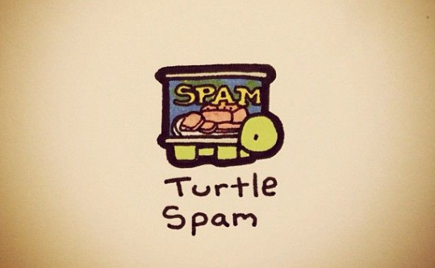

# This Week In TurtleCoin

Feb 26, 2019

---

# This Week In TurtleCoin (Feb 25, 2019)

_Finally! Unless you’ve been under a rock somewhere you might have noticed something the last day or so. Coming by a block without about a thousand transactions waiting to get in it ahead of you was pretty tough if you were trying to sync a wallet yesterday. Kind of makes you wonder, was this an attack or was TRTL suffering from an inability to tolerate any and all types of traffic?_

_Both, is your answer. Like we’ve said before, this is far from the worst we’ve seen, but any time transactions are slowed down and mining is impacted, we have to jump into action…. And action is what took place! Keeping with tradition, we released a hot patch, courtesy of Zpalmtree which effectively limits the amount of “extra data” you can tack on to a transaction. Everything that needs to fit in a transaction will still fit in a transaction after the patch takes place, just with less wiggle room for any BS._

Thanks for your patience while we got things cleared up :D and now for our developer updates…

# Developer Updates

There is a pending fork upgrade in 9 days, if you care about transactions flowing as fast as usual, please make sure you’ve updated to help push out spam attacks like these in the future -

**Japawolf Meetup —** Japakar and greywolf’s rescheduled meetup was a great success! There was some hardware exchanged — some video adapters for this (<https://turtlenode.co/img/colorswitching-turtle.gif>), and Japakar got a handful of TurtleCoin stickers that Browns1964Champs sells. greywolf wore his TurtleCoin t-shirt from DonMatus on Amazon. Most of the convo was about TurtleCoin: challenges of non-devs to setup and keep running a public node (including the good and bad of using the HA wrapper vs just simply making a script of commands), the pros and cons of various wallets currently in use, the great camaraderie in the community, and the quality and abundance of spot-on support from so many friendly turtles. They also talked a little DeroGold chatter; different techniques in web hosting; comparison between hosting services, with and without VPS; and a little normie shit. **— Japakar & greywolf**

**TurtleCities** — We are growing quickly at 45 current users and plenty more on the waiting list :) Just a reminder for those on the waiting list, if you want to move up to the front of the line, just hop in discord and talk to RockSteady and if you ask nicely you can have a free account too. What is TurtleCities? Well, a lot of us old tortoises used to use a service called Geocities in the early days to make free homepages to show our flashy gifs to our friends and share our embarrassing music preferences, so we thought it’d be cool to have something similar for TRTL users and we named it TurtleCities. You get 1 floppy disk worth of space to express yourself to your heart’s content. You’d be surprised what people have done with their pages! We also offer paid services like linux shell accounts and dual density floppy storage, with a 100% no-money-back guarantee on service quality and outages. **You can’t beat it, folks.**

**Thinkpol’s page** — <http://pages.turtlecoin.lol/~thinkpol/>

**Tgroh007’s page** — <http://pages.turtlecoin.lol/~tgroh007/>

**PeteOnealJr’s Page —** <http://pages.turtlecoin.lol/~peteonealjr/>

**Emperor’s Page** — <http://pages.turtlecoin.lol/~emperor/>

**Wesley’s Page** — <http://pages.turtlecoin.lol/~wesley/>

**My page** — <http://pages.turtlecoin.lol/~rocksteady/>

credit -> @turtlewayne on instagram

**The Great Spam Incident of 2019 —** For those who skim, the top part mentioned briefly a spam attack. If you’d like, here’s a grossly exaggerated and satirized sequence of events, sponsored by TMZ.

The last day or so, someone was uploading 0.1 TRTL transactions by the hundred, which were packed to the brim with the same nonsense data over and over, and a picture of a red mario shell with the little yellow points above it. We lol’d, then we cried. It disrupted the flow of transactions because the transaction pool quickly swelled to almost 10k transactions that we had to chew through in order to get through it all. In a perfect world that’s no problem for our network, we have really fast blocks that are pretty stretchy, but this time that fought us somewhat as I also mentioned the transactions were filled with trash. In two days we added a few hundred megabytes to the chain, and had a taste of what mainstream adoption would mean volumewise on-chain.

A hot patch was pushed out first to our biggest block producers to get them to agree to stop pushing nonsense, or as little nonsense as possible with the transactions in their blocks. We don’t want to deny that traffic, we just don’t think someone should be able to pack the traffic full of trash that we have to carry for all of history. We did this by limiting the size of something called TX\_Extra, which is similar to the OP\_Return field if you’re familiar with BTC and how extra data works in their transactions. Typically what goes in this field is a payment ID, or an encrypted chat message, or whatever you want to put in there evidently.

The turtle shell gif was funny, but the network choked as our smallest daemons were tapping out as their mempools started flooding. Each daemon has a record of the transactions it sees waiting in line for processing, and at a certain point the size of that waiting list can cause them to shut down. For some reason, nobody knows why, this almost never affects Windows daemons, as much as that hurts to say. As things reached a fever pitch, the biggest block producers had implemented the fix and we began chopping through the weeds to clear out the work (we currently sit with 2 transactions in the pool as I write this) things started to show signs of calming down.

_Fuckery, Act II —_ Well, as one might ask, what happens when someone splits their entire stack into a mountain of little tiny pennies (pennii?), well of course, they have to convert them back into dollar bills don’t they?

Enter TRTL’s second Achilles Heel, the fusion transaction backlog, AKA the Coinstar of Death.. When someone needs to make a transaction consisting of a lot of inputs, the wallet might try to “fuse” some of those to turn the little pennies into dollars. We’ve done articles about this in the past, so it’s not a new concept and it helps us a lot, and usually any slowness in the chain is usually a large exchange doing a full fusion optimize on their wallet. Unfortunately constantly cranking out the spam-pennies for two days straight means you have a LOT of pennies to turn back into dollars, and they’re limited as to how many can be converted in each block by a ratio set in the code. To make matters worse, we have the same issue we mentioned before because these fusions tend to flood the transaction pool with at times \*thousands\* of transactions.

More chewing ensued. Much patience was had by the community as the miners strapped their hardhats on and went to work yet again to clear out the weeds, and many hours later here we are. Core team’s going to hibernate for a day or some and come back with some updates that have a bit more finality to them rather than being a patch. Thanks for your patience and help in getting this fixed :) **— TRTL Core Team**

# Bounty Hunters!

**10,000 TRTL —** Write a guide on mining TRTL on an iOS phone with the app XMR Miner. Must be modeled after existing guides, I can give a hand wherever needed! **— Sajo8**

**200–700 TRTL** per fix — Help correct information or fix broken links in the turtlecoin docs! Bounty depends on information fixed, feel free to contact me for more info — Sajo8

# Easy Beginners For Devs

_Want to get your feet wet being a developer at TRTL? Here’s a list of issues in our core Github repo that Zpalmtree has marked as “Good First Issues” which are easy low hanging fruit for people to earn their pink Developer role in Discord. Here is a link and brief description just in case you’re interested!_

**Add RPC method to validate address** 
<https://github.com/turtlecoin/turtlecoin/issues/733>

**Prune spent inputs after some period of time from WalletBackend** 
<https://github.com/turtlecoin/turtlecoin/issues/708>

**Add https support to cpp-httplib/nigel** 
<https://github.com/turtlecoin/turtlecoin/issues/713>

**Support Blockchain cache API in Nigel** 
<https://github.com/turtlecoin/turtlecoin/issues/712>

**Add a logger to WalletBackend** 
<https://github.com/turtlecoin/turtlecoin/issues/709>

**Daemon+WalletBackend timestamp adjustments** 
<https://github.com/turtlecoin/turtlecoin/issues/704>

**Display unlock time / timestamp in list/incoming/outgoing\_transfers zedwallet/zedwallet++** 
<https://github.com/turtlecoin/turtlecoin/issues/675>

# Community Advertising

FlowMine TurtleCoin Pool, from the owner of FlowMine DEGO Pool. Happy mining! :) [— http://trtl.pool.flowmine.xyz](http://trtl.pool.flowmine.xyz/)

New pool from the owner of FlowMine DEGO Pool. Trying to find more users to mine with us. Feel free to come over and dig some TRTL. You can also use our remote node to sync your wallet: trtl.pool.flowmine.xyz:11800

# Shoutouts & Thanks

Big thanks to Zpalmtree for the mobile android wallet and the hot patch, I hope you’re sleeping well :D — rock

Thanks to whoever spammed the chain so we could get stuff done that we should have done anyway — rock

Thanks to Fipsi for donating his skills toward our project. Same goes to the rest of you. — Mining4Vets

_Originally published at_ [_TurtleCoin_](http://blog.turtlecoin.lol/archives/this-week-in-turtlecoin-2/)_._