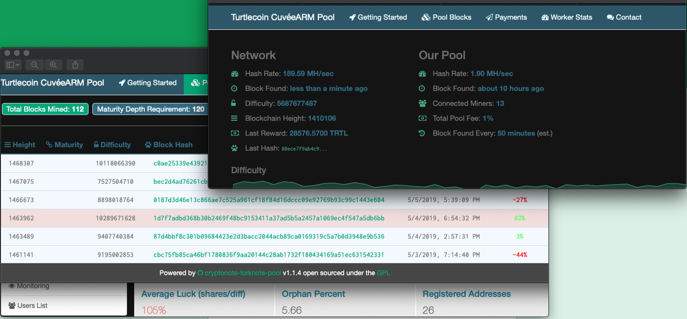
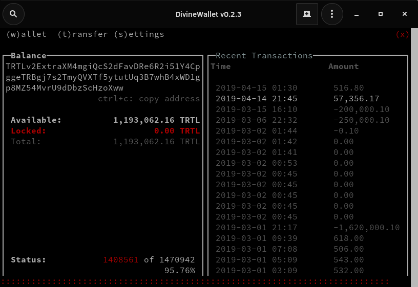
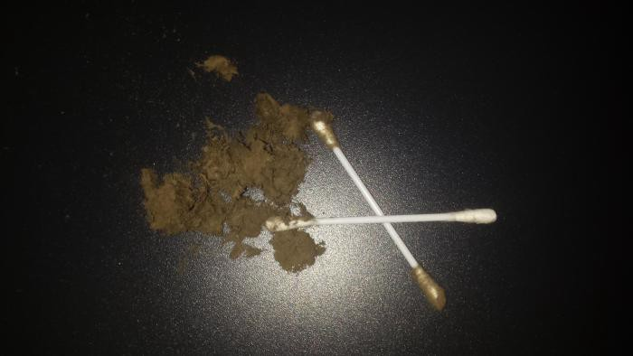

# This Week In TurtleCoin (May 7, 2019)

May 7, 2019

---

_This is a place where anybody in our community can submit a post about the TRTL project they’re working on. It’s a great way to attract helpers for your project and show people what to keep an eye out for. We encourage you to show works in progress as well as finished products, as we’re happy to see them all and it shows that we’re an active community._

**To submit your story, click this link** <https://docs.google.com/forms/d/e/1FAIpQLSdTs4nDSKai2fPpCnuT0WXzutCuJQk7nFlFqYCgmBlz4DEM7Q/viewform>

## Developer Updates

**Cuvée bits and bobs updates**

First things first, cannot believe it was end of March we posted our last update. Reading through the TRTL updates from previous weeks, a lot has happened — and this is true also on the CuvéeTRTL front.

1\. Our TurtleCoin pool that runs on ARM SBC hardware passed a stress test successfully. We consider that pool now a mature, stable and reliable. Why? We asked our fellow community members to burn the pool down with tons of a hash-rate\*. We had volunteers who together aimed at us their miners of a total hash power of 1.9MH/s\*\* for a total time of 15 hours. And… nothing happened. No drama. No crash. I remember how TP2 commented on this that evening: “The only thing you failed to achive with this test is to crash the pool! :-)”

\*actually I said “I will pay 10k TRTL to everyone who participates on smashing the pool up to 1MH/s hash rate. All participants bounties paid out!  
\*\*special thanks to @E\*\*\*m

2\. Same boring stuff on the ARM SBC based pool. At the time of writing this roundup, the pool mined 112 blocks, orphan rate 5.66%, all that in two months between 6th March — 6 May 2019\. Well done you lovely little beast! This is the future of decentralized, distributed computing!

3\. We started [http://cuveebits.com](http://cuveebits.com/) which I see as a personal project focused on Singleboard. Distributed. Open. Computing. Best Things In Life Are Blended. There is a lot of relevant TurtleCoin stuff, such as how to run a miner or a node on ARM SBC hardware, which one does best in our view and soon(TM) we will publish lesson’s learned from running TurtleCoin mining pool on ARM SBC. We hope some of the cuveebits.com posts will make it to the main TurtleCoin blog, as we discussed recently with Rocksteady!

**@LeoCuvée**

There are 6 turtles hidden in this image.

**shellnet**

Long time no update :(. I finally pushed the captcha, ratelimiter, and transaction history code to github. If you’ve forked shellnet, make sure to pull the latest updates. Also, shellnet now supports url parameters that will automatically fill out the transaction form. ie. <https://shellnet.pw/account?address=ADDRESS&amount=100&paymentid=PAYMENTID>  
I’m also in the process of cleaning up and replacing most of the codebase. I’ll probably integrate some of the new Go features. Stay tuned :D

**dsanon**

[turtlecoin/shellnet-webwallet-goA turtlecoin web wallet WIP. Contribute to turtlecoin/shellnet-webwallet-go development by creating an account on…github.com](https://github.com/turtlecoin/shellnet-webwallet-go)

**Turtacus**

Turtacus disappeared for a while because he ran out of funds and people stopped using him. Due to requests, I have reactivated him, however, his prizes fund will not be topped up unless the community decide to top it up. Turtacus prizes are set to a percentage of his total tipjar, so if the community fills his tip jar, the community will benefit from prizes.  
Unfortunately, I have had little to no spare time lately and this is why Turtacus was put to sleep. I will poor my head in as often as I can to make sure everything is going ok but please remember you can DM me if you need help

**Rynem**

checkpoints broke, everybody abandon ship

**Checkpoints, what checkpoints?**

For those of you who sync your own daemons, you might know about a thing we use called ‘checkpoints’. You may have also noticed that the checkpoints repo hasn’t seen an update in almost a week.

> To put it simply, Github isn’t a CDN.

What does that mean? We’ve been generating a file every day for a long time now, and every day it gets larger and larger. We started getting complaints as we approached 100mb, and now we’re over 100mb and show’s over. Github isn’t meant for large file storage and distribution, so we’re looking at new options to get this file delivered to you. Likely we’ll just split up the checkpoints file and continue as usual, but a few of us are checking out other options like IPFS as a potential backup option.

OK, I’ll admit, it’s pretty much just me who sees anything in that idea, but who knows, maybe we get IPLD going and offer an option for IPFS block storage. I’m not promising anything, or even that we’ll go further than “looking in to it”, so if you’d like to discuss your ideas or help implementing this one, hop on over to dev\_general.

**Rock**

This video was a bit inspiring and pushed me a bit further into my “looking in to it”

**Running a public node for fun and profit?**

This update was inspired by our conversation together one night with @Elkim about some of the public services. We spotted a trend. Similar to what happened with pool services, in order to attract more miners (respectively more Wallet users to public node services), the community as a whole has the tendency to compete how little TRTLs charged for a brilliant service.

The screenshot introducing this update — demonstrates how the public services are slowly converging to zero. Yet we’ve noticed a few fellow community members in the Discord channels saying they had trouble to sustainably keep their services running, many opting out from it after a while.

Yet I hear many of you probably saying, well, but I do not need to charge more TRTL for my public service, I am doing it for the community. And you might be perfectly right. You personally may not need to charge more. But if you do, you’re more likely to give away in bounties, tips to other members, support or recognition for other folks creating a fun or useful service.

This is why both me and @Elkim raised transaction fees on our public nodes to the other side of the spectrum. To balance things out. We believe in value’s ability to create value.

I used the title for this update based on Rocksteady’s article “Running a Public TRTL Node For Fun and Profit”. We admire you and the community loves you for the fun element and dedication. Keep in mind though … if not the profit, then the sustainablity factor, at least! We don’t want to see you go away frustrated from undercutting the value of the service you provide.

**@LeoCuvée**

**Divine**

Hello everyone, development has been coming along well with Divine, my new wallet utilizing turtlecoin-wallet-backend-js. It’s currently pretty stable and does all of the things you’d expect a wallet to do, here’s the current feature list:

* Create new wallet files
* Open saved wallet files
* Import wallets from mnemonic seeds
* View current balance
* View current sync status
* Send a transaction
* Export private keys

If you’d like to try it out, you can install it with npm by using the following two commands: (you’ll need wget, nodejs, and npm installed)

`wget <https://github.com/turtlecoin/turtlecoin-wallet-nodejs/releases/download/v0.2.4/divinewallet-0.2.4.tgz>`

`npm i -g divinewallet-0.2.4.tgz`

Then run the wallet from anywhere with

`divine`

I’d really like if people could try it out and let me know what they think. If anyone has features they’d like to see implemented, please raise an issue at the GitHub repository:

[turtlecoin/turtlecoin-wallet-nodejsA Text-based User Interface (TUI) Wallet for TurtleCoin - turtlecoin/turtlecoin-wallet-nodejsgithub.com](https://github.com/turtlecoin/turtlecoin-wallet-nodejs/issues)

Additionally, if anyone would like to help, I’ve raised several issues in the repo that indicate the direction I want to head in improving the wallet further. Thanks alot to @zoidbergZA for the PR to migrate to typescript.

Thanks Turtle Community and peace out!

**ExtraHash**

[turtlecoin/turtlecoin-wallet-nodejsA Text-based User Interface (TUI) Wallet for TurtleCoin - turtlecoin/turtlecoin-wallet-nodejsgithub.com](https://github.com/turtlecoin/turtlecoin-wallet-nodejs)

When you can hear your bot stirring and making noise, but can’t recognize a word of it.

**.trtl TLD ChatOps bot**

To streamline things with checking and approving domain proposals, we’ve begun creating a bot that will help separate the wheat from the chaff when someone wants to register a domain.

Currently the bot can answer a few commands and validate whether you’ve supplied it with part of the correct syntax. It works a bit like this:  
`.trtl register A rock.user.trtl 19.69.42.0`

The bot would respond with a turtle emoji to signal that the correct syntax has been used for the A/CNAME/TXT classifier and the IP address (maybe, we’ll see if spaft can pull it off haha) and once we get the rules for domain names plugged in it should be ready to be hooked up to some actual automation like triggering the repo and approving/denying applications.

Skynet is upon us. Press F to pay respects.

**Rock**

## Rig(s) Of The Week!

Last week, I derp’d and posted the same RotW as the week before, so this week let’s do two of them!

**VegasMiner** by ZenMaster (MrLahaye)

This is the computer I use for gaming and work.

It’s powered by :  
\- 1000W GOLD PSU from OCZ.  
\- Asus X370-F Motherboard  
\- AMD Ryzen 1700x (Cooled by a Corsair H100)  
\- GeIL SUPER LUCE RGB 16GB RAM (2 x 8GB / PC4 24000)  
\- XFX AMD Radeon RX Vega 64 8GB (Unmodifed bios)  
\- MSI AMD Radeon RX Vega 56 8GB (Unmodifed bios)

_What are your secret tips and tricks about mining TRTL?_

For this kind of setup my suggestion is:  
Use either a dual boot partition to have an OS dedicated to gaming and one for mining or a bootable USB Key.

My name is ZenMaster (MrLahaye),

I’m a hobbyist cryptoccurency miner that started mining Dogecoin about 5 years ago with a single GPU AMD Radeon 7950.  
Afterwards, I’ve bought some SHA256 USB ASIC Block Eruptor and a powered USB hub to experiment with the equipment, software, etc.  
I took a break from mining until 2017 and started buying some used equipment on ebay until today.  
I now have 2 Gaming computers, 2 Rigs and a third one coming in soon. Will be posting all of them in the coming weeks.

**Average : -Ryzen 1700X : 10800 h/s -Vegas 64 : 16 000 h/s -Vegas 56 : 16 000h/s**

**“Fake Vega Rig” by Zerouan**

17–20 kh/s depending on overclock

**Community Advertising**

_CuvéeARM TurtleCoin Public Node for sending your large amount transactions. Low power consumption. Powerful. Reliable. Just of you. 1900 TRTL fee per transaction._ [_http://publicnode.ydns.eu:11898_](http://publicnode.ydns.eu:11898/)

Shoutouts & Thanks

**greywolf** — thanks to all the developers working their asses off in the #dev channels, really behind the scenes to the average user. it’s fun to watch them collaborate on different things in our open atmosphere. well, at least it looks fun to a non-developer. of course, i gotta duck now and then when things start getting thrown around a bit, but it always settles down and is worth the reading.

**Rock —** \[this space for rent.\]

**greywolf** — thanks to Sierra for always bringing joy and sunshine with her.

_Originally published at_ [_TurtleCoin_](http://blog.turtlecoin.lol/archives/this-week-in-turtlecoin-may-7-2019/)_._