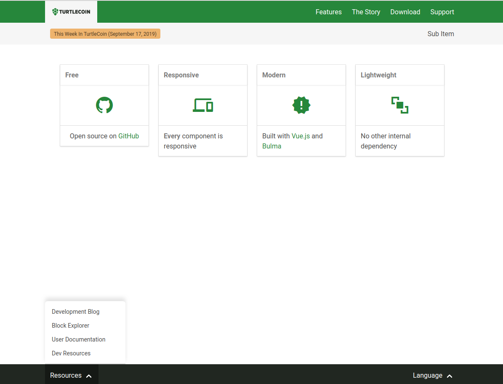
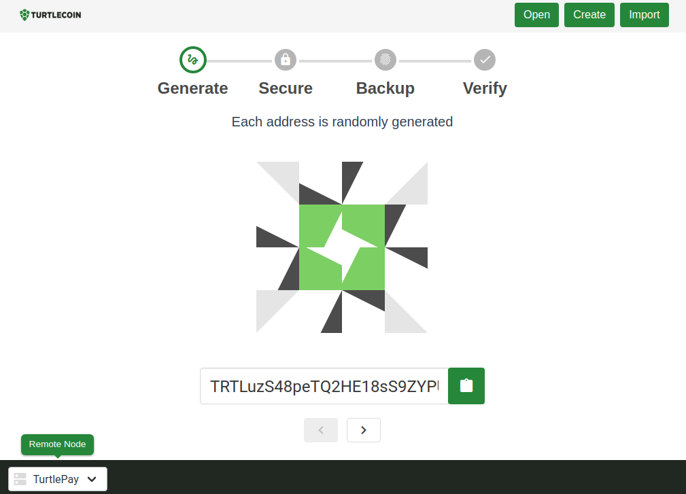

# This Week in TurtleCoin (October 8, 2019)

Oct 9, 2019

---

Welcome to a new roundup! Now with more last-week in every bite!

## Developer Updates

This is a place where anybody in our community can submit a post about the TRTL project they’re working on. It’s a great way to attract helpers for your project and show people what to keep an eye out for. We encourage you to show works in progress as well as finished products, as we’re happy to see them all and it shows that we’re an active community.

## turtlecoin.lol

Thanks to The Judge#9063 from Discord who rightfully pointed out the misuse of the Windows 10 logo on turtlecoin.lol. While fixing this squeeze, it came to my attention that our own dang website does not only break the Microsoft guidelines but also our own. yikes! Luckily, it was not much of a hassle to fix it.

Meanwhile, I have started the development of a brand new version of turtlecoin.lol. Powered by nuxt.js, allowing serverless deployment it will follow a more streamlined design deployed already by our block explorer.

**fexra**

## TurlteCoin Web Wallet (Client Side)

This week updated the styling of the web wallet according to TurtleCoin brand guidelines and completed validation on wallet creation. andrew | trtl.rocks in the Discord chat was so kind to show me how to properly use Vuex store. Recently, I have decided to give nuxt.js a try, and decided to use this framework also for this web wallet, which currently only uses vue.js. nuxt.js extends vue.js by offering various presets to build progressive web apps that are SEO friendly and can be hosted in serverless environments.

**fexra**

## violetminer

If you read last weeks update, you’ll see I was pretty close to making a violetminer release. This release went out a few days ago, and in fact, i made another release just yesterday.

If you didn’t read last weeks update, the major feature is NVIDIA GPU support.  
Please download it and give it a go, and let me know what you think. There are binaries for Windows, Linux, Mac OSX, and ARM.  
I wrote a guide on how to use it here: <https://docs.turtlecoin.lol/guides/mining/violetminer-guide>

The update I made just yesterday, adds SSL pool support. I kinda forgot about adding this earlier, the HashVault admin helpfully reminded me :)  
If your pool offers SSL ports, you can now connect to them with violetminer — Just download v0.1.1 and set ssl to “”true”” in your config file.  
I also added some better validation of your config file, so if you accidentally mess up your nvidia settings, you should get an informative error instead of a crash.

I have a few more quality of life features to add, then I’ll probably start trying to add AMD support.

**Zpalm**

[turtlecoin/violetminerA CPU and NVIDIA miner for TurtleCoin / Chukwa / Argon2id / WrkzCoin. Go here to download the latest release. If you…github.com](https://github.com/turtlecoin/violetminer)

## Database Compression

This happened a couple of weeks ago, but I don’t think anyone ever mentioned it. We recently merged a pull request from CapEtn which adds ZSTD compression to the daemon, and enables it by default.

ZSTD is much more performant than the LZ4 compression we had in place previously, and also has a minimal effect on daemon speed from our testing. If you want to take advantage of the database compression, you’ll need to compile the latest code, or wait for a new release. Then, if you have an existing database, you’ll need to delete the DB folder, or resync your daemon.

You should find that your database folder has decreased to about 59GB from somewhere around 76GB. A quite nice saving!

You can of course disable this option if you want your daemon to be as snappy as possible.

**Zpalm**

[Replace LZ4 Compression With ZSTD Compression, Compression By Default, New DB default parameters…Piggy backs off #873 and the information found in wrkzcoin/wrkzcoin#4 Remove --rocksdb option for the local cache…github.com](https://github.com/turtlecoin/turtlecoin/pull/886)

## TRTL ATM

TRTL ATM is a virtual vending machine which you can get TRTL by paying through third party payment service provider; currently only Paypal is available. The purpose of this project is to demonstrate what can be done with Turtlecoin and inspire anyone that is interested in blockchain, cryptocurrency, and programming.

As a self-taught developer, the initiative of this project is to make the process of getting your first turtlecoin simpler, especially for people that are new to crypto.

We know there are several ways to get turtlecoin. Below are the ones I can think of, however, each one has its own incovenience:

1. Buy it from cryptocurrency exchanges.
2. Mining
3. Hosting nodes
4. Faucet

Let me explain.

1. Buying turtlecoin is troublesome for new people, because not only they have to create an acocunt in the exchange, but also they need to first get some BTC or LTC, transfer it to their wallet in the exchange, then trade it with TRTL, then withdrawl from the exchange to their TRTL wallet.
2. Mining and hosting nodes. Though Turtlecoin already has a rich collection of documentation, you still need to be somewhat okay or at least feel comfortable using all the command line stuff, this is sometime intimidating to people who are not familiar with programming. In addition, you need extra hardware to do these things.
3. Faucet is just not practical when you want to get certain amount of TRTL at once.

Therefore, if there is a platform where you can just spend your worthless government money in exchange for some TRTL, and have it directly sent to your turtlecoin wallet, it would save a lot trouble when your only goal is to just get some TRTL into your wallet.

This concept is not new, and I want to see it in TRTL.  
BTC has it in many countries, there are even physical BTC ATM machines, so why not for TRTL?

Frankly speaking, I do not have fund for this project, otherwise this concept can be extended as when you spend your worthless government money, the platform can directly purchase it in a exchange, then send it to your turtlecoin wallet. Therefore, as a demonstration project, I have set a fixed rate; 1 to 1 ratio with the USD to prevent too many people using it at this point.

However, TRTL ATM works, and if you would like to try it, you can just try with 1 TRTL. I have only deposit around 10000 TRTL to the TRTL ATM wallet, and whoever purchsed TRTL from TRTL ATM will become a contributor and your wallet address, nickname, and the amount you contributed will be displayed on the page. The money will be used for hosting public node and the web server.

Full disclosure, I spend around 25 USD per month hosting a public node and with this TRTL ATM web server hosting, there will be another 5 to 10 USD extra.

If all 10000 TRTL are purchased, I will start looking for partners to work with me and extend this project.

**Sabo (Revolutionary)**

## Proton Wallet v1.0.0 Out, Proton Moves to Monthly Release Schedule

Hey everybody, ExtraHash here. I’ve just released version 1.0.0 of Proton Wallet for TurtleCoin®. It’s got quite a lot of new features, check out the release page linked below for the full details. However, a **VERY IMPORTANT** detail:

There is user action required for this update. The wallet open dialog now only looks for wallet files ending in the .wallet extension, as well as uses this extension by default when saving. If your wallet file does not have this extension, you will not be able to see it in the open dialog. You must manually rename your wallet file and give it the proper extension .wallet.

Throughout developing this wallet, I’ve been working alot with both zpalm and iburnmycd troubleshooting some errors in transaction sending. We’ve successfully found and squashed quite a lot of bugs in may different places along the way, so hopefully this will improve the overall GUI wallet experience for everybody! It’s very cool to see the entire team come together and troubleshoot something collectively, and it’s great to be a part of it.

In addition, Proton Wallet is now moving to a monthly release schedule. I realize the (very) frequent updates might have gotten a bit annoying (especially at a binary size of 60+ MB per update), and as I feel the wallet is very solid at this point, it makes sense to slow down the updates a bit so they can be tested more thoroughly and hopefully done in a more organized way.

Signing off for now, stay cool TurtleCoin community.

**ExtraHash**

[turtlecoin/turtle-wallet-protonYou can't perform that action at this time. You signed in with another tab or window. You signed out in another tab or…github.com](https://github.com/turtlecoin/turtle-wallet-proton/releases)

## Moving Up!

It’s always good to be recognized! These are the people who gained new roles in the community this week!

**Congratulations to Extrahash for gaining Core Contributor role!**

Watter and Craig regained Footclan role, tmac25 gained contributor, khorosho gained DJ role

## Rig Of The Week

Do you have a TRTL mining rig you want to show off? Tell us about it!

## zerouan vega rig one

this rig is running hiveos linux and teamredminer if i can sleep then the miners mine i’m zerouan 525 kh/s @917watt at the wall

## Shoutouts & Thanks

This is the place to mention someone in the community who has done something nice or deserves recognition.

wll1rah bogdanadnan, thanks for the great ninjarig miner and the help that you have provided in getting to work with mali GPU with OpenCL.  
greywolf thanks for the server shakup; it caught me off guard, but all is well  
greywolf cheers and thanks to Muf, who put together a spiffy home page for my node: [https://turtlenode.co](https://turtlenode.co/)

_Originally published at_ [_TurtleCoin_](http://blog.turtlecoin.lol/archives/this-week-in-turtlecoin-october-8-2019/)_._