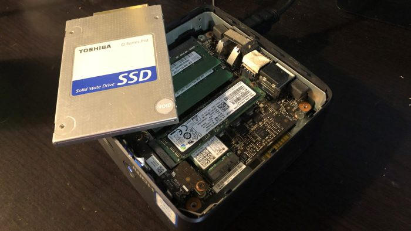
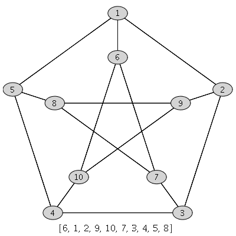

# This Week In TurtleCoin (May 19, 2020)

May 20, 2020

---

## Developer Updates

_This is a place where anybody in our community can submit a post about the TRTL project they’re working on. It’s a great way to attract helpers for your project and show people what to keep an eye out for. We encourage you to show works in progress as well as finished products, as we’re happy to see them all and it shows that we’re an active community._ [**_To submit your post, click this link_**](https://docs.google.com/forms/d/e/1FAIpQLSdTs4nDSKai2fPpCnuT0WXzutCuJQk7nFlFqYCgmBlz4DEM7Q/viewform)

## The New TRTL Website & Translations

The initiative to get our new website up and moving is heating up and we’re getting a lot of translations submitted. Mrrovot has been leading the charge with a lot of work put in so far on a cool way to integrate some type of language toggle to the website so that international users can browse in their own language.

We’re not quite there yet, I think there’s some right-to-left stuff in the works that was mentioned, but don’t quote me on that. Just wanted you guys to know that we’re working on it and will have it out soon with our new brand package etc.

**Rock**

[turtlecoin/trtl2020To submit or propose changes to turtlecoin.lol, submit a pull request to this repository. This project uses Jekyll to…github.com](https://github.com/turtlecoin/trtl2020)

## profl.trtl.io

A few weeks ago, I launched a Turtlecoin node at [profl.trtl.io](http://profl.trtl.io/) (which is actually just an nginx proxy server pointing to the actual node, which is sitting on my desk as I write this). All was fine and dandy, except that the SSD in it was only 250 gigabytes; more than sufficient for the TRTL blockchain, but only barely enough to hold all the other things I use this server for. Luckily, I had a few extra 256 gigabyte drives lying around, one of which was solid state, and upon opening up the mini-PC I discovered an open SATA connector, power and all. After reformatting it, mounting it, cp’ing the blockchain over, adjusting my daemon config, and finally some finagling with /etc/fstab, I had everything working. It’s a huge relief to have freed up all that space on the original SSD, and as a bonus, this new drive is much more portable if I ever want to migrate the node elsewhere.

Oh, and my home network now has far more bandwidth and almost flawless uptime, so there should be no issues there either anymore.

**Professor L**

[profl.trtl.io](http://profl.trtl.io/)

## Karai Updates

I find myself holding back some times on putting all of the week’s karai stuff in the roundup because it can easily dominate the main conversation. Let’s hit some quick bullet points to get you guys caught up on what we’re doing here:

I promise we’re not in the illuminati
* **karai dev blog** is up @ [karai.io/dev](https://karai.io/dev/) — starting out with an article about designing the channel connection process, which has been a big part of what I’ve been working on lately. Check it out <https://karai.io/dev/k/2020-05-14-Designing-the-channel-connection-process.html>
* **p2p is getting an update** — I was talking some trash with the nerds at the water cooler and we came to the conclusion that in the beginning it makes more sense to use a custom p2p solution for the karai p2p stack. Some things that are _nice to have_ will be added later, but with some best-practice principles in mind, we can do fine with a bespoke solution for preliminary implementations and talk about using a third party library when we need to do more complicated things like NAT traversal.
* **client header** — The client header was created this week for the go-karai client. The client header is like a user agent string from a browser, which helps the application deliver a more tailored experience. In our case it helps the channel connection process by sending the channel coordinator client info of a peer wishing to join the channel.
* **join tx type** — A new transaction type is being evaluated. The ‘join’ transaction would be a non-linked transaction that has no related subgraphs that consists of the initial peer announcement of a peer coming online. I’m about 50/50 on this, I’ll be honest. It makes the connect process convenient but i have this subconscious bias to think announce is something that belongs in p2p even though its their for sync purposes. The purpose of the join tx type is to allow you to ‘mark’ your entry to a channel to avoid looking at anything before that, which speeds up the already-fast sync process.

## Free Advertising

_This is a spot to spam anything TurtleCoin related that you would like to advertise, it’s free to put an ad in the roundup._

Sync faster with bootstrap powered by bot.tips. Bootstrap data is regularly updated. [https://trtl-data-dir.bot.tips](https://trtl-data-dir.bot.tips/) Use remote node — blockcache version: trtl.bot.tips:80 and trtl.bot.tips:443 to support discord TipBot. <https://trtl.bot.tips/fee>

## Shoutouts & Thanks

_This is the place to mention someone in the community who has done something nice or deserves recognition._

dsanon shout out to rock for all the hard work on karai! :DD thanks ds :)

## TRTL Dev Afterhours

_The afterhours section is a new column we are trying out that aggregates all of the links from_ **_#Dev\_OffTopic_** _for the week so we can share them with you guys._

this wordpress theme wont let be add the damn links.
* “Update vanitygen to output mnemonic · professor-l/go-turtlecoin@45c5f13 · GitHub  
A Golang implementation of TurtleCoin software. Contribute to professor-l/go-turtlecoin development by creating an account on GitHub.  
<https://github.com/professor-l/go-turtlecoin/commit/45c5f131cbc278b05d921f55111f9720ac1413d8>  
Submitted by Professor L on Wed, 29 Apr 2020 14:51:18 GMT”
* “SQLite License  
<https://www.hwaci.com/cgi-bin/license-step1?>  
Submitted by iburnmycd on Thu, 30 Apr 2020 02:51:15 GMT”
* [“https://github.com/BurntSushi/ripgrep](https://github.com/BurntSushi/ripgrep).  
Submitted by zpalmtree on Thu, 30 Apr 2020 19:56:23 GMT”
* “Introducing OS 1 — Urbit  
OS 1 is somewhere between ‘productivity software’ and a ‘social network’. We think it’s the beginning of an altogether new breed of social computing.  
<https://urbit.org/blog/introducing-os1/>  
Submitted by RockSteady (TRTL) on Fri, 01 May 2020 09:59:41 GMT”
* “Ethereum (ETH) Co-Founder Announces 1,000,000 Tx/s Network: Details  
The Polkadot (DOT) cross-chain sharded protocol is among the most technically advanced projects of the whole blockchain industry. Now its mainnet is anticipated even more  
<https://u.today/ethereum-eth-co-founder-announces-1000000-txs-network-details>  
Submitted by rashedmyt on Sun, 03 May 2020 06:13:48 GMT”
* “RC4 — Wikipedia  
https://en.wikipedia.org/wiki/RC4  
Submitted by Professor L on Sun, 03 May 2020 12:40:35 GMT”  
“Variably Modified Permutation Composition — Wikipedia  
<https://en.wikipedia.org/wiki/Variably_Modified_Permutation_Composition>  
Submitted by Professor L on Sun, 03 May 2020 12:41:15 GMT”
* “vmpc\_c/vmpc.c at master · bartek96/vmpc\_c · GitHub  
Implementation VMPC stream symmetric cipher in C. Contribute to bartek96/vmpc\_c development by creating an account on GitHub.  
<https://github.com/bartek96/vmpc_c/blob/master/vmpc.c>  
Submitted by Professor L on Sun, 03 May 2020 12:42:02 GMT”
* “Codespaces · GitHub  
Your instant dev environment  
<https://github.com/features/codespaces>  
Submitted by RockSteady (TRTL) on Thu, 07 May 2020 01:41:57 GMT”
* “Using Ed25519 signing keys for encryption  
@Benjojo12 and I are building an encryption tool that will support SSH keys as recipients. For Ed25519 keys that requires converting points between different elliptic curves. Let’s see why and how.  
<https://blog.filippo.io/using-ed25519-keys-for-encryption/>  
Submitted by RockSteady (TRTL) on Thu, 07 May 2020 15:50:27 GMT”
* “Finding Ticketbleed  
Ticketbleed (CVE-2016–9244) is a software vulnerability in the TLS stack of certain F5 products that allows a remote attacker to extract up to 31 bytes of uninitialized memory at a time, which can contain any kind of random sensitive information, like in Heartbleed. If you suspect you might be affected  
<https://blog.filippo.io/finding-ticketbleed/>  
Submitted by rashedmyt on Thu, 07 May 2020 16:32:05 GMT”
* “my\_first\_calculator.py/my\_first\_calculator.py at master · AceLewis/my\_first\_calculator.py · GitHub  
my\_first\_calculator.py. Contribute to AceLewis/my\_first\_calculator.py development by creating an account on GitHub.  
<https://github.com/AceLewis/my_first_calculator.py/blob/master/my_first_calculator.py>  
Submitted by Turtle Max on Sun, 10 May 2020 00:40:14 GMT”
* “Getting Started With Xmonad — YouTube  
In this rather lengthy video, I go over the basics of getting started with Xmonad. I install Xmonad on Ubuntu 20.04 and show some of the basics as far as con…  
<https://www.youtube.com/watch?v=3noK4GTmyMw>  
Submitted by RockSteady (TRTL) on Fri, 15 May 2020 19:21:58 GMT”
* “FPGA Subsystem — The Linux Kernel documentation  
<https://www.kernel.org/doc/html/latest/driver-api/fpga/index.html>  
Submitted by RockSteady (TRTL) on Sun, 17 May 2020 03:24:47 GMT”

There’s a lot more than this, but it didn’t seem right to paste the entire link history of a chat room we’ve had for over a month :) If you want to check out the other things that have been posted here or just BS with us, check out chat.turtlecoin.lol

Thanks for reading :)

_Originally published at_ [_TurtleCoin_](http://blog.turtlecoin.lol/archives/this-week-in-turtlecoin-may-19-2020/)_._