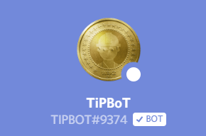

# This Week In TurtleCoin (June 9, 2020)

Jun 10, 2020

---

This week we saw lots of new faces in the chat and many new users asking all the great questions new users ask, and as a bonus, diff has gone back to a sensible level. All in all, a good week!

## Developer Updates

_This is a place where anybody in our community can submit a post about the TRTL project they’re working on. It’s a great way to attract helpers for your project and show people what to keep an eye out for. We encourage you to show works in progress as well as finished products, as we’re happy to see them all and it shows that we’re an active community._

## Brand Updates

There have been a few changes made to the TurtleCoin® branding over the last few months and we felt the need to summarize a few of the high points as we’re very proud of these changes.

## Branding Guide

The branding guide for TurtleCoin received a refresh a few months ago. It contains updated guidelines on how to properly reference the registered Trademark, proper use of logos or symbols, the wordmark, as well as font selections and the new color scheme (don’t worry, the green isn’t going anywhere).

## Presentation Slide Templates

Rock also took the time to create a slick new set of presentation slide templates that anyone can use when presenting on TurtleCoin topics, technologies, or general promotions. These templates present a crisp, clean, and consistent message to those we wish to introduce to various TurtleCoin topics.

## Website

For those of you who haven’t noticed, the official website at [https://turtlecoin.lol ](https://turtlecoin.lol/)also received a much needed facelift. Rock, @mrrovot, and a few others contributed to the new simplier design that follows the new guidelines. We’ll be working on updating a few other core maintained site(s) to reflect the new look and feel across the board.

[TurtleCoinTurtleCoin is a decentralized Peer-2-Peer Open Source electronic currency. It's easy to get, completely private, and…turtlecoin.lol](https://turtlecoin.lol/)

## TurtleCoin.com

Those of you that frequent the chat have likely seen a few interactions that haven’t always ended very… well between a few community members and uaoverall. uaoverall _allegedly_ secured the domain name [turtlecoin.com](https://turtlecoin.com/) almost two years ago by purchasing it from a domain name squatter for much more than the fair market rates that a registrar like NameCheap charges.

Since then, he’s forwarded [turtlecoin.com](https://turtlecoin.com/) to [turtlecoin.lol](https://turtlecoin.lol/) in the hopes that one day the official project site would be migrated from [turtlecoin.lol](https://turtlecoin.lol/) to [turtlecoin.com](https://turtlecoin.com/). Unfortunately, without getting into the details, every time discussion came up, things always ended up very heated. Suffice it to say, the topic coming up every few months the past two years starts to grind a little bit (on both sides).

With this in mind, IBurnMyCd stepped up to the plate and worked out a deal with uaoverall to transfer the ownership of the domain to the same organization that holds the Trademark.

The most interesting part of all of this is that this very well might be the very first actual contract paid entirely in TurtleCoin. While the details of the contract aren’t being shared (to protect both parties), it’s very cool whenever TurtleCoin is used for a real-world transaction.

With this deal, the team is happy to report that the [turtlecoin.com](https://turtlecoin.com/) domain name is now securely in a member of Core’s hands. For now, the domain is retaining its forwarding role to [turtlecoin.lol](https://turtlecoin.lol/) until such a time that the community may decide that switching from [turtlecoin.lol](https://turtlecoin.com/) to [turtlecoin.com](https://turtlecoin.com/) makes sense.

Thankfully, we can now put this issue to rest and leave it well behind us as the community moves forward with everything everyone is doing to make TurtleCoin the go to network for fast, safe, and fun transactions.

## Karai Updates

This week I did a significant amount of work getting the channel joining process working, and we had our first connection to a karai transaction channel on a remote network :) Since then, a few users seem to have forked the software and have pinged the stagenet a few times. It is definitely interesting to see.

The work done regarding connecting to channels is the process that is outlined in IBMCDs hackmd diagram for building a cert authority.

[Node to Coordinator Communication - HackMDNode to Coordinator Communication \`\`\`sequence Participant Node Participant Coordinator Note righthackmd.io](https://hackmd.io/@ZL2uKk4cThC4TG0z7Wu7sg/H1Ubn6d9L)

Here is a link to the rough layout of what we are doing, it is a large diagram showing the process that takes place when a node is connecting to a karai transaction channel. In short a websocket connection is made to the channel coordinator, if it is your first time joining the channel, your client will generate new keys via ed25519 and do an exchange and signing process with the channel coordinator. If your certificate is good, you will be allowed to connect.

Here is a summary of the steps for connecting to channels with an indicator of what is done so far, which is about half way, with most of the difficult stuff done.

// \[✔️\] Coord: Generates Secret Key (CA:SK)and Public Key (CA:PK)  
// \[✔️\] Coord: Signs CA:PK with CA:SK(CA:S)  
// \[❌\] Coord: Publishes CA:S & CA:PK in pointer record  
// \[✔️\] Node: Generates Secret Key (N1:SK) and Public Key(N1:PK)  
// \[✔️\] Node: Initial Connection Sends N1:PK to Coord  
// \[✔️\] Coord: Signs N1:PK with CA:SK (N1:S)  
// \[❌\] Coord: Sends CA:N1:S to Node  
// \[ \] Node: Verifies N1:S using known CA:PK from pointer (Good Coordinator)  
// \[ \] Node: Signs N1:PK with N1:SK (N1:S)  
// \[ \] Node: Sends N1:S to Coord  
// \[ \] Coord: Hashes (N1:S) and signs with CA:SK Node1 Cert (N1:C)  
// \[ \] Coord: Sends N1:C to Node  
// \[ \] Node: Requests Cert Revocation List  
// \[ \] Coord: Sends CRL to Node

When I finish with this, I will be adding a new transaction type, Join Transactions which allow a channel to track and announce new peers joining the swarm. This will help shorten the already short amount of time to sync your history when reconnecting to a channel.

Some things coming after that are:  
\- subgraph construction  
\- graph explorer  
\- libraries for go and js clients

## TRTLNIC

Now that we’ve had a steady run of OpenNIC Tier-2 servers running for well over 6 months, it’s time to put on our big boy pants and actually apply to OpenNIC to accept .trtl domains everywhere. To do so though, we need to graduate from the github based DNS management to something more… automated.

I’ve been working the last few days to continue work I was doing on building a nifty REST API that can be used to register, manage, and perform basic functions with .trtl domains. Think of it like… like… your favorite unnamed registrars. This will make maintaining the system of .trtl domains a lot easier, have built in payment support using TurtlePay, live updates, basic managed DNS for the domains, and a few other cool features I’m baking in. No, I haven’t published any of the code yet, but I’m working to assemble it as quickly as possible. Most of the difficult stuff is done so at this point, there’s very little to do except put together the actual web interface that talks to the API. Hopefully I’ll have more news to post on this in the next few days/weeks.”

IBMCD & Frens

[.trtl TLDFill out an application, give us your dns info for your site, and point your servers at your new domain. It's pretty…trtlnic.com](https://trtlnic.com/)

## Moving Up!

_It’s always good to be recognized! These are the people who gained new roles in the community this week!_

Moving down in this case! We removed the Ninja role, which was basically just me on there most of the time anyway. It felt counterproductive to have the highest rank be the most inactive so we removed it to get closer to the purple guys :)

We also created a moderator role for the possible impending changes to the market talk rules.

## Free Advertising

_This is a spot to spam anything TurtleCoin related that you would like to advertise, it’s free to put an ad in the roundup._

Mine on MuxDux, the pool with the grassiest roots around! [https://trtl.muxdux.com](https://trtl.muxdux.com/) Important Public Service Announcement for TipBot This message goes out to every single one of you in our cryptocurrency Discord servers to raise awareness about the one and only TipBot we have all come to know and love. Did you know that you can get an invite link to invite TipBot to a new server by direct messaging the bot with the command ‘.invite’? You can also write the message ‘.invite’ in the bots channel to get a link there. We are calling out for everybody’s help with doing this so that we can see the TipBot’s usage explode to new heights globally. All we really need you to do is invite the TipBot to other discord servers that it is not yet in so that we can continue to teach people around the world that cryptocurrency transacting can be quick, easy, and user-friendly. This TipBot allows you to send crypto coins to anyone on Discord, 24/7, with no fee due to the utilization of off-chain tipping. The TipBot also includes a built-in faucet feature that is an engaging way for getting newbies started with learning how to navigate the bot’s system and giving them possibly their first ever crypto coins to mess around with. This faucet operates by the user command ‘.take’ and when utilized it gives out a small stack of a random coin absolutely free (one of WRKZ, DEGO, BTCMZ, TRTL, and DOGE respectively). This command is currently able to be used once every 24 hours. On the flip side, if you’re feeling generous you can tip the TipBot directly with one of those coins and it will be added into the faucet’s stockpile. In the same giving spirit, you can also directly donate any of the supported cryptocurrencies directly to the TipBot’s open source developer (@pluton#8888 on discord \[id: 386761001808166912\]) using command ‘.donate’ to help keep the bot up and running for the long run. Pluton says that ultimately his main goal is to spread awareness of cryptocurrency through tips and get more people from all over the world involved. As always you can type command ‘.help’ to see a full list of all the command prompts provided by this impressive bot! Thanks for reading our special announcement and don’t forget to invite!! Current TipBot Stats as of June 7th 2020 Discord Servers Currently in: 159 Total Users Online: 22,773 Total Unique Users: 175,907 Total Discord Channels Spanned: 6,239 Documentation: <https://github.com/wrkzcoin/TipBot> TipBot Video Tutorial: <https://www.youtube.com/watch?v=Htg6HKLmPZ0> Discord TipBot Verification Explained: <https://support.discord.com/hc/en-us/articles/360040720412-Bot-Verification-and-Data-Whitelisting>

AARDVARK node, purveyor of the highest quality wallet sync and transaction services. Connect to sync.tippyturtle.com:11898 from CLI or GUI. sync.tippyturtle.com:11898

## Shoutouts & Thanks

_This is the place to mention someone in the community who has done something nice or deserves recognition._

zerouan i would like to thank rock for unleash zerouannita zerouan i would like to thank brat for having improved audio at karaoke and i would also like to thank lilly meraviglia for the support she bring us everyday in the chat rock thanks to brat and zerouan for keeping karaoke going all night while we code :)

## TRTL Dev Afterhours

_The afterhours section is a new column we are trying out that aggregates all of the links from #Dev\_OffTopic for the week so we can share them with you guys._

<https://www.kernel.org/doc/html/latest/driver-api/fpga/index.html>'  
Submitted by ExtraHash on Sun, 17 May 2020 20:54:59 GMT **The Cyber Security Hub™ posted on LinkedIn**  
May 17, 2020: The Cyber Security Hub™ posted on LinkedIn  
<https://www.linkedin.com/posts/the-cyber-security-hub_activity-6667850684374876160-X3xJ>  
Submitted by iburnmycd on Sun, 17 May 2020 21:37:51 GMT **Openrouteservice Maps**  
Openrouteservice is a open source route planner with plenty of features for car, heavy vehicles, hiking and cycling.  
[https://maps.openrouteservice.org](https://maps.openrouteservice.org/)  
Submitted by RockSteady (TRTL) on Wed, 20 May 2020 13:48:01 GMT **The Rogue Experimenters | The New Yorker** 
**Community labs want to make everything from insulin to prostheses. Will traditional scientists accept their efforts?**  
<https://www.newyorker.com/magazine/2020/05/25/the-rogue-experimenters>  
Submitted by RockSteady (TRTL) on Wed, 20 May 2020 15:22:54 GMT **Gemini Gateway**  
<https://portal.mozz.us/gemini/gemini.circumlunar.space/>  
Submitted by RockSteady (TRTL) on Fri, 22 May 2020 00:57:39 GMT **tildeverse**  
<https://tildeverse.org/>  
Submitted by RockSteady (TRTL) on Fri, 22 May 2020 05:03:40 GMT **GitHub — cris691/discohash: Discohash — A super fast and simple hash. 5GB/s serial (depending on hardware).**  
:dancers: Discohash — A super fast and simple hash. 5GB/s serial (depending on hardware). — cris691/discohash  
<https://github.com/cris691/discohash>  
Submitted by RockSteady (TRTL) on Sat, 23 May 2020 16:12:03 GMT **GitHub — tevador/hashx: A family of pseudorandomly generated hash functions for proof-of-work and client puzzles**  
A family of pseudorandomly generated hash functions for proof-of-work and client puzzles — tevador/hashx  
<https://github.com/tevador/hashx>  
Submitted by cryptonote.social on Sat, 23 May 2020 18:44:45 GMT **To merge or not to merge \[part 2\] · Issue #27 · wownero/meta · GitHub** 
**The last time we had a discussion about merge mining, the general consensus was to push the envelope by adopting RandomJS** (RandomX) early in order to serve as an interesting test-bed for Monero. We forked to RandomWOW on 2019–06–14 befor…  
<https://github.com/wownero/meta/issues/27#issuecomment-633108497>  
Submitted by cryptonote.social on Sat, 23 May 2020 18:45:30 GMT **ed25519 — The Go Programming Language**  
Go is an open source programming language that makes it easy to build simple, reliable, and efficient software.  
<https://golang.org/pkg/crypto/ed25519/>  
Submitted by RockSteady (TRTL) on Sun, 24 May 2020 02:21:21 GMT **GitHub — google/tink: Tink is a multi-language, cross-platform, open source library that provides cryptographic APIs that are secure, easy to use correctly, and hard(er) to misuse.**  
Tink is a multi-language, cross-platform, open source library that provides cryptographic APIs that are secure, easy to use correctly, and hard(er) to misuse. — google/tink  
<https://github.com/google/tink>  
Submitted by RockSteady (TRTL) on Sun, 24 May 2020 02:38:19 GMT **GitHub — k0kubun/pp: Colored pretty printer for Go language** 
**Colored pretty printer for Go language. Contribute to k0kubun/pp development by creating an account on GitHub.**  
<https://github.com/k0kubun/pp>  
Submitted by RockSteady (TRTL) on Sun, 24 May 2020 02:48:38 GMT **GitHub — myspaghetti/macos-virtualbox: Push-button installer of macOS Catalina, Mojave, and High Sierra guests in Virtualbox for Windows, Linux, and macOS** 
**Push-button installer of macOS Catalina, Mojave, and High Sierra guests in Virtualbox for Windows, Linux, and macOS — myspaghetti/macos-virtualbox**  
<https://github.com/myspaghetti/macos-virtualbox>  
Submitted by RockSteady (TRTL) on Sun, 24 May 2020 11:44:22 GMT **TurtleCoin IPFS Checkpoints**  
<http://ns1.turtlecoin.lol/ipfs>  
Submitted by RockSteady (TRTL) on Tue, 26 May 2020 16:49:36 GMT <https://youtu.be/PF3gzLssFzk>  
Submitted by RockSteady (TRTL) on Fri, 29 May 2020 16:24:04 GMT **GopherCon 2016: Rob Pike — The Design of the Go Assembler — YouTube**

<https://youtu.be/KINIAgRpkDA>  
Submitted by RockSteady (TRTL) on Sun, 31 May 2020 18:29:11 GMT

**80-characters-per-line limits should be terminal, says Linux kernel chief Linus Torvalds • The Register**  
As he gives us version 5.7 with support for Apple power tech and better exFAT  
<https://www.theregister.com/AMP/2020/06/01/linux_5_7/>  
Submitted by zpalmtree on Mon, 01 Jun 2020 15:33:46 GMT **Knex cheatsheet**  
One-page guide to Knex: usage, examples, and more. Knex is an SQL query builder for Node.js.This guide targets v0.13.0.  
<https://devhints.io/knex>  
Submitted by zpalmtree on Thu, 04 Jun 2020 21:15:58 GMT **LackRack — Eth0Wiki**  
<https://wiki.eth0.nl/index.php/LackRack>  
Submitted by ExtraHash on Fri, 05 Jun 2020 17:14:57 GMT **Permanent SSH Tunnels with autossh | Linuxaria**  
Article by Truelite.it already published on their useful wiki (in Italian) There are many occasions where you need to create connections to machines and services that are protected by firewalls because it is appropriate to adequately protect them, but for which the creation of a VPN becomes an excessive burden. For  
<https://linuxaria.com/howto/permanent-ssh-tunnels-with-autossh>  
Submitted by ExtraHash on Sat, 06 Jun 2020 01:05:37 GMT **Welcome — File Browser**  
<https://filebrowser.xyz/>  
Submitted by ExtraHash on Sun, 07 Jun 2020 04:48:45 GMT <https://crypto.stanford.edu/craig/craig-thesis.pdf>  
Submitted by if(true) on Mon, 08 Jun 2020 11:37:27 GMT **Haiku R1/beta2 has been released!**  
<https://www.haiku-os.org/news/2020-06-09_haiku_r1_beta2/>  
Submitted by RockSteady (TRTL) on Tue, 09 Jun 2020 22:19:55 GMT

You looked. There is no sense in denying it. You looked.

_Originally published at_ [_TurtleCoin_](http://blog.turtlecoin.lol/archives/this-week-in-turtlecoin-june-9-2020/)_._